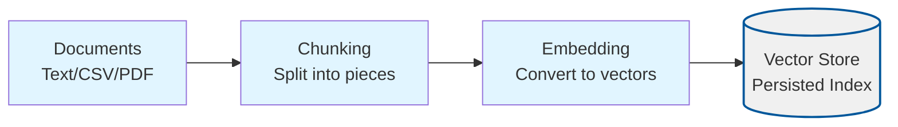
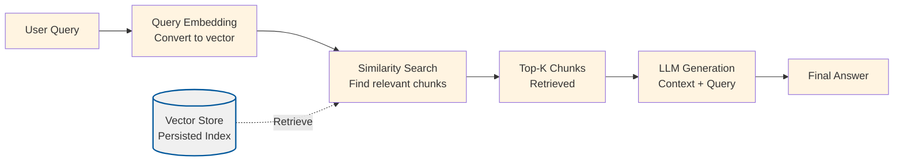

# RAG Techniques (TypeScript Monorepo)

This repository is a TypeScript / Node.js port of the advanced RAG techniques collection from [`NirDiamant/RAG_Techniques`](https://github.com/NirDiamant/RAG_Techniques), organized as a monorepo with one project per technique.

## Project Description and Rationale

This project serves as an educational resource for understanding Retrieval-Augmented Generation (RAG) systems. Each subproject demonstrates a specific RAG technique or enhancement, providing:

- **Clear, focused implementations** - Each technique is isolated in its own project with dedicated scripts
- **Comprehensive documentation** - Extensive JSDoc comments and detailed READMEs explain concepts and code
- **Practical examples** - Working code that you can run, modify, and learn from
- **Shared utilities** - Common functionality (document loading, embedding, vector storage) is centralized for reuse

The monorepo structure allows you to:
- Compare different techniques side-by-side
- Understand how techniques build upon each other
- Experiment with configurations and parameters
- Learn RAG concepts incrementally, from basic to advanced

## Understanding RAG Systems

Retrieval-Augmented Generation (RAG) is a technique that enhances language models with external knowledge by retrieving relevant information from a document collection before generating responses. Here's how a basic RAG system works:

### Document Ingestion

The ingestion process prepares documents for retrieval by converting them into searchable vector embeddings:



### Query Processing

The query process retrieves relevant information and generates answers:



> **Note**: Some projects have variations on these processes (e.g., CSV-RAG processes CSV rows differently, proposition-chunking extracts propositions before embedding, HyDE generates hypothetical documents at query time). See individual project READMEs for project-specific diagrams.

### Key Components Explained

1. **Documents**: Source materials (text files, PDFs, CSVs) that contain the knowledge you want to query
2. **Chunking**: Splitting large documents into smaller, manageable pieces (typically 400-1200 characters) to fit embedding model limits and improve retrieval precision
3. **Embedding**: Converting text chunks into dense vector representations that capture semantic meaning using language models
4. **Vector Store**: A searchable database of embeddings and their corresponding text chunks, stored persistently as JSON files or in a cloud Vector DB
5. **Query Embedding**: Converting the user's question into the same vector space as document chunks
6. **Similarity Search**: Finding the most relevant chunks by comparing vector similarities (typically cosine similarity)
7. **LLM Generation**: Using a language model to generate answers based on the retrieved context and the original query

### Why RAG?

RAG addresses key limitations of language models:

- **Knowledge Cutoff**: LLMs are trained on data up to a specific date and may not know recent information
- **Hallucination**: LLMs may invent facts when they don't know the answer
- **Domain Specificity**: General models may lack expertise in specialized domains
- **Source Attribution**: RAG allows you to trace answers back to source documents

By retrieving relevant information first and providing it as context, RAG systems can:
- Answer questions about recent events and specific documents
- Ground answers in verifiable sources
- Reduce hallucination by constraining the model to use provided context
- Support domain-specific applications without retraining models

## Project Structure

This monorepo follows a clear structure that separates shared code from individual project implementations:

```
rag-techniques/
├── projects/              # Individual RAG technique implementations
│   ├── basic-rag/        # Baseline RAG implementation
│   ├── csv-rag/          # Structured CSV retrieval
│   ├── reliable-rag/     # Retrieval validation techniques
│   └── ...               # Additional techniques
├── shared/               # Shared code and resources
│   ├── typescript/utils/ # Reusable utilities (logging, config, LLM, vector stores)
│   ├── schemas/          # JSON schemas for config validation
│   └── assets/data/      # Sample datasets and documents
├── docs/                 # Documentation
│   ├── product.md        # Product requirements and roadmap
│   ├── project-structure.md # Detailed structure documentation
│   └── plan.md           # Implementation planning
└── tools/                # Development tools and scripts
```

### Key Directories

- **`projects/`**: Each subdirectory contains a complete, standalone RAG technique implementation with its own configuration, source code, tests, and README
- **`shared/typescript/utils/`**: Common utilities used across all projects (document loading, chunking, embedding, vector storage, logging, configuration)
- **`shared/assets/data/`**: Sample documents (PDFs, text files, CSVs) used by multiple projects for testing and examples
- **`shared/schemas/jsonschema/`**: JSON schemas for validating configuration files across projects

Each project stores runtime artifacts (vector indexes, evaluation outputs) in its own `.tmp/` directory, which is tracked by git (via `.gitkeep`) but whose contents are ignored.

## Prerequisites

Before getting started, ensure you have:

- **Node.js 22.x** or higher
- **pnpm** package manager (install via `npm install -g pnpm`)
- **OpenAI API Key** - Set as `OPENAI_API_KEY` environment variable or in a `.env` file at the repository root

### Installation

1. **Clone the repository**:
   ```bash
   git clone <repository-url>
   cd rag-techniques
   ```

2. **Install dependencies**:
   ```bash
   pnpm install
   ```

3. **Set up environment variables**:
   Create a `.env` file at the repository root:
   ```bash
   OPENAI_API_KEY=your-api-key-here
   ```

### Quick Start

Each project can be run independently. Here's how to get started with the baseline project:

```bash
# Navigate to a project
cd projects/basic-rag

# Ingest documents (builds the vector index)
pnpm run ingest

# Query the system (interactive CLI)
pnpm run query
```

See each project's README for detailed setup instructions, configuration options, and usage examples.

## Projects

The following table lists all available RAG technique projects. Each project demonstrates a specific technique or enhancement to the basic RAG pipeline.

| Project | Description | What It Demonstrates | README |
|---------|-------------|---------------------|--------|
| **basic-rag** | Foundational RAG implementation | Document chunking, embedding generation, vector storage, semantic retrieval, and context-augmented generation. Serves as the baseline for understanding all other techniques. | [README](projects/basic-rag/README.md) |
| **csv-rag** | Structured retrieval from CSV files | Automatic column inference (text vs metadata), row-to-document conversion, dual-purpose columns for semantic search and structured filtering, and metadata preservation during retrieval. | [README](projects/csv-rag/README.md) |
| **reliable-rag** | Retrieval validation and quality control | Dual-criteria validation (embedding similarity + lexical overlap), transparent validation scoring, excerpt highlighting, and graceful degradation when validation fails. | [README](projects/reliable-rag/README.md) |
| **chunk-optimizer** | Chunking parameter benchmarking tool | Offline chunk size and overlap analysis, redundancy calculation, structural property measurement, and configuration optimization guidance. | [README](projects/chunk-optimizer/README.md) |
| **proposition-chunking** | Fact-based retrieval using LLM-extracted propositions | Two-stage extraction (chunking then proposition generation), proposition quality grading, proposition-level retrieval instead of raw chunks, and filtering by grounding scores. | [README](projects/proposition-chunking/README.md) |
| **query-transform** | Query transformation techniques | Query rewriting (adding specificity), step-back prompting (generating broader context queries), sub-query decomposition (breaking complex queries into simpler ones), and combining multiple transformation strategies. | [README](projects/query-transform/README.md) |
| **hyde** | Hypothetical Document Embedding | Runtime synthetic document generation, embedding answers instead of questions, document-style query representation, and bridging the query-document semantic gap. | [README](projects/hyde/README.md) |
| **hype** | Hypothetical Prompt Embedding | Offline question generation during ingestion, question-question matching instead of question-document matching, multiple embeddings per chunk for better coverage, and pre-computed retrieval enhancement. | [README](projects/hype/README.md) |

### Project Roadmap

We are porting 34 techniques from the original [`NirDiamant/RAG_Techniques`](https://github.com/NirDiamant/RAG_Techniques) repository. Current status:

- **Phase 1 (Complete)**: Basic RAG, CSV RAG, Reliable RAG, Chunk Optimizer, Proposition Chunking
- **Phase 2 (Complete)**: Query Transform, HyDE, HyPE
- **Future Phases**: Context enrichment, advanced retrieval (fusion, reranking), evaluation frameworks, explainability, graph RAG, and agent architectures

See `docs/plan.md` for detailed planning and status of upcoming projects.

## Learning Path

For beginners, we recommend this learning path:

1. **Start with `basic-rag`** - Understand the core RAG pipeline: ingestion, embedding, retrieval, and generation
2. **Try `chunk-optimizer`** - Learn how chunk size and overlap affect your system before building indexes
3. **Explore `csv-rag`** - See how RAG adapts to structured data formats
4. **Experiment with `reliable-rag`** - Understand validation techniques for improving answer quality
5. **Advance to `query-transform`** - Learn how to improve retrieval by transforming queries
6. **Compare `hyde` and `hype`** - Understand different approaches to bridging the query-document gap

Each project builds upon concepts introduced in previous ones while introducing new techniques you can apply to your own RAG systems.

## Documentation Standards

All projects follow consistent documentation standards:

- **Extensive JSDoc comments** explaining code functionality, parameters, and examples
- **Comprehensive READMEs** covering overview, configuration, setup, usage, and troubleshooting
- **Validation scenarios** for quickly verifying that systems work end-to-end
- **Clear examples** demonstrating key concepts and use cases

For detailed documentation requirements, see `docs/product.md`.

## Contributing

This is an educational project focused on clarity and learning. When contributing:

- Follow the existing code structure and documentation patterns
- Add extensive JSDoc comments explaining concepts
- Include validation scenarios in READMEs
- Update `docs/project-structure.md` when adding new shared utilities
- Ensure tests pass and code follows TypeScript best practices

## License

[Add your license information here]

## Acknowledgments

This project ports and extends techniques from the excellent [`NirDiamant/RAG_Techniques`](https://github.com/NirDiamant/RAG_Techniques) repository, adapting them for TypeScript/Node.js and organizing them as a monorepo for better learning and comparison.
