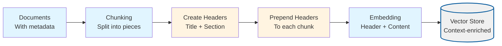
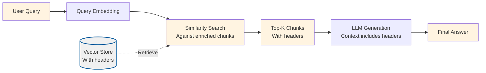

# Chunk Headers (Contextual Chunk Headers)

## Overview

This project implements **Contextual Chunk Headers**, a technique that improves retrieval quality by prepending document- and section-level metadata to each chunk before embedding. This preserves high-level context (such as document title and section information) alongside the chunk content, giving embeddings a more accurate and complete representation of the text's meaning.

Chunk Headers addresses a fundamental problem in RAG systems: **individual chunks often lack sufficient context to be properly understood**. When chunks are retrieved in isolation, they may:
- Refer to subjects via implicit references and pronouns that aren't clear without context
- Only make sense in the context of the entire section or document
- Be misleading when read on their own

By prepending contextual headers to chunks before embedding, we ensure that the embedding model "sees" the document title and section information, leading to better semantic understanding and improved retrieval precision.

## What Makes This Project Unique

**Chunk Headers** introduces **metadata-enriched chunking** that preserves hierarchical context:

- **Header Construction**: Automatically creates headers from document metadata, combining `title` with optional `section`/`category` information
- **Physical Prepend**: Headers are physically prepended to chunk text (not just stored as metadata), so similarity search "sees" the context during embedding
- **Zero Configuration**: Works automatically when documents have title and optional section metadata - no special configuration needed
- **Preserves Structure**: Maintains document hierarchy in retrieval without requiring separate vector dimensions or complex metadata filtering

### How the Unique Concepts Work

1. **Header Generation**: For each document, the system creates a header string using:
   - **Title**: Always included from `doc.title` (or "Untitled document" if missing)
   - **Section**: Optionally included from `doc.metadata.section`, `metadata.sectionTitle`, or `metadata.heading`
   - **Category**: Optionally included from `doc.metadata.category` or `metadata.topic`
   
   The header format is:
   ```
   Title: Document Title
   Section: Section Name / Category Name
   ```

2. **Header Prepend**: Each chunk from the document has the header prepended to its content before embedding:
   ```
   Title: Document Title
   Section: Section Name
   
   [Original chunk content...]
   ```
   
   This means the embedding model processes the header + content together, creating embeddings that understand the context.

3. **Automatic Application**: Headers are created and prepended automatically during ingestion using shared utilities (`createDocumentHeader` and `prependHeaderToChunks`). No manual configuration is required beyond ensuring documents have appropriate metadata.

### How to Adjust for Different Use Cases

- **For documents with rich metadata**: Add `section`, `category`, or `heading` fields to document metadata to create more informative headers
- **For documents without metadata**: Headers will still include the document title, providing basic context
- **For chunk size concerns**: If headers increase chunk length significantly, you can reduce `chunkSize` slightly (e.g., from 800 to 750) to account for header overhead
- **For better precision**: Ensure documents have descriptive titles and section metadata - the more context in headers, the better retrieval precision

## Process Diagrams

Chunk Headers modifies the ingestion process to prepend headers before embedding:

### Ingestion Process



### Query Process

The query process follows the standard RAG pattern, but retrieved chunks include header context:



## Configuration

The project is configured via `config/chunk-headers.config.json`:

```json
{
  "chunkSize": 800,
  "chunkOverlap": 200,
  "topK": 4,
  "embeddingModel": "text-embedding-3-small",
  "chatModel": "gpt-4o-mini",
  "dataPath": "../../shared/assets/data",
  "indexPath": ".tmp/index/chunk-headers.index.json"
}
```

### Configuration Parameters Explained

**Standard RAG Parameters** (same as basic-rag):
- `chunkSize`: Characters per chunk (default: 800)
  - Note: Headers are prepended to chunks, so actual chunk content may be slightly smaller
  - Headers typically add 50-150 characters depending on title and section length
- `chunkOverlap`: Overlap between chunks (default: 200)
- `topK`: Number of chunks to retrieve (default: 4)
- `embeddingModel`: OpenAI embedding model (default: "text-embedding-3-small")
- `chatModel`: LLM for answer generation (default: "gpt-4o-mini")
- `dataPath`: Path to documents directory (default: "../../shared/assets/data")
- `indexPath`: Path to vector index file (default: ".tmp/index/chunk-headers.index.json")

**No Special Parameters Required**: Chunk headers work automatically when documents have title and optional section metadata. The header generation is handled by shared utilities.

### Runtime Data Directory (`.tmp/`)

- Generated artifacts (vector indexes) are written to the project-local `.tmp/` directory
- The directory is committed (via `.gitkeep`) so contributors know where runtime files belong, but contents are ignored via `.gitignore`
- Deleting `.tmp/` is safe; `pnpm run ingest` will recreate the files
- The vector index stores chunks with headers already prepended, so headers are preserved in retrieval

## Setup

1. **Install dependencies** (from repository root):
   ```bash
   pnpm install
   ```

2. **Set up environment variables**:
   Create a `.env` file at the repository root with:
   ```bash
   OPENAI_API_KEY=your-api-key-here
   ```

3. **Prepare sample data**:
   The project uses sample data from `shared/assets/data/` by default (configured via `dataPath`). You can modify `dataPath` to point to your own document directory.
   
   **Note**: For best results, ensure your documents have:
   - A `title` field (or filename will be used)
   - Optional `metadata.section`, `metadata.category`, or `metadata.heading` fields for richer headers

## Usage

### Step 1: Ingest Documents with Headers

This script reads documents, chunks them, prepends contextual headers to each chunk, generates embeddings, and stores them in a vector index.

```bash
cd projects/chunk-headers
pnpm run ingest
```

**What happens during ingestion:**
1. Loads configuration from `config/chunk-headers.config.json`
2. Reads all `.txt` and `.md` files from the directory specified in `dataPath` (default: `shared/assets/data/`)
3. Splits each document into chunks of `chunkSize` characters with `chunkOverlap` overlap
4. **For each document**:
   - Creates a contextual header from document title and metadata (section/category)
   - Prepends the header to all chunks from that document
5. Generates embeddings for each header-enriched chunk using the specified embedding model
6. Stores chunks and embeddings in an in-memory vector store
7. Persists the vector store to `.tmp/index/chunk-headers.index.json`

**Expected output:**
```
{"level":"info","message":"Reading documents for chunk-headers",...}
{"level":"info","message":"Chunking documents with contextual headers",...}
{"level":"info","message":"Created chunks",...}
{"level":"info","message":"Generating embeddings",...}
{"level":"info","message":"Persisted vector index",...}
```

### Step 2: Query the RAG System

This script loads the vector index and provides an interactive CLI for asking questions.

```bash
cd projects/chunk-headers
pnpm run query
```

**What happens during querying:**
1. Loads the vector index from the persisted file
2. Initializes embedding and chat clients
3. Enters an interactive loop:
   - Prompts for a question
   - Embeds the question into a vector
   - Searches the vector store for the top-K most similar chunks (which include headers)
   - Constructs a prompt with the retrieved context (headers visible in the prompt)
   - Sends the prompt to the LLM for answer generation
   - Displays the answer with source chunk information

**Example interaction:**
```
> What is Nike's revenue strategy?
```

The system will:
- Find the 4 most relevant chunks from the ingested documents
- Show similarity scores for each chunk
- Generate an answer based on those chunks
- The retrieved chunks will include header context (Title: ..., Section: ...) which helps the LLM understand the context

Type `exit` to quit the interactive session.

### Validation Scenario

To verify that ingestion and querying work correctly, use this validation scenario:

**Setup**: Ensure you have ingested documents (run `pnpm run ingest`).

**Test Query**: "What is Nike's revenue strategy?"

**Expected Behavior**:
1. The system should retrieve relevant chunks from the Nike annual report (default sample document)
2. Retrieved chunks should include header context (e.g., "Title: Nike Annual Report")
3. Similarity scores should be logged (typically 0.7-0.9 for relevant chunks)
4. The answer should mention revenue-related strategies from the document
5. The logs should show:
   - Query embedding generation
   - Retrieval results with scores
   - Answer generation status
   - Headers visible in the retrieved chunk content

**Verification**: Check the logs for:
- Retrieval scores and chunk counts
- Answer generation status
- The answer should be grounded in the retrieved document content
- Retrieved chunks should show header lines (Title: ..., Section: ...) in the prompt context

## Expected Outcomes

### After Ingestion

- A vector index file is created at `.tmp/index/chunk-headers.index.json`
- The file contains all document chunks with headers prepended and their embeddings
- You can see how many chunks were created from your documents
- Headers are embedded as part of the chunk content, not stored separately

### During Querying

- **Relevant Retrieval**: The system should retrieve chunks that are semantically similar to your question, with better precision due to header context
- **Contextual Answers**: Answers should be grounded in the retrieved document content, with headers providing additional context
- **Transparency**: You can see which chunks were used (with similarity scores) and the header context helps understand document structure
- **Better Precision**: Headers help the system distinguish between chunks from different documents or sections, reducing irrelevant results

### Example Queries and Expected Behavior

**Query**: "What is the main topic of the document?"
- **Expected**: Retrieves chunks containing overview or introduction content, with headers showing document title
- **Answer**: Should summarize the document's main themes, with headers providing document context

**Query**: "What are the key financial metrics?"
- **Expected**: Retrieves chunks with numbers, statistics, or financial data, with headers showing which document/section they're from
- **Answer**: Should list specific metrics mentioned in the documents, with better precision due to header context

**Query**: "What is the weather today?"
- **Expected**: Retrieves chunks (if any) but they won't be relevant
- **Answer**: Should indicate that the information is not available in the provided context

## Understanding the Code

### Key Components

1. **`src/ingest.ts`**: Document ingestion pipeline with header enrichment
   - `runIngestion()`: Orchestrates the ingestion process
   - Uses `createDocumentHeader()` to generate headers from document metadata
   - Uses `prependHeaderToChunks()` to add headers to chunks before embedding
   - Standard embedding and storage process

2. **`src/query.ts`**: Interactive query interface
   - `interactiveQuery()`: Main query loop that handles user input and generates answers
   - Standard retrieval process (headers are already in chunk content)

3. **Shared Utilities** (in `shared/typescript/utils/`):
   - `chunking.ts`: Contains `createDocumentHeader()` and `prependHeaderToChunks()` functions
   - `vectorStore.ts`: Vector storage and similarity search
   - `llm.ts`: OpenAI client wrappers for embeddings and chat
   - `config.ts`: Configuration loading and validation
   - `types.ts`: TypeScript type definitions

### How It Works: The Chunk Headers Pipeline

```
Documents (with metadata) → Chunking → Header Generation → Header Prepend → Embedding → Vector Store
                                                                                        ↓
Query → Embedding → Similarity Search → Top-K Chunks (with headers) → LLM Prompt → Answer
```

1. **Chunking**: Documents are split into smaller pieces using standard fixed-size chunking
2. **Header Generation**: For each document, a header is created from title and optional section/category metadata
3. **Header Prepend**: The header is physically prepended to each chunk's content (not just stored as metadata)
4. **Embedding**: Text chunks (now including headers) are converted to dense vectors that capture semantic meaning
5. **Storage**: Vectors are stored with their original text (including headers) for later retrieval
6. **Retrieval**: Query is embedded and compared to stored vectors using cosine similarity
7. **Generation**: Retrieved chunks (with headers visible) are used as context for the LLM to generate an answer

**Key Insight**: By embedding headers as part of chunk content, the embedding model learns associations between document structure and content, leading to better semantic understanding and improved retrieval precision.

## Troubleshooting

### "OPENAI_API_KEY is not set"
- Ensure you have a `.env` file at the repository root with your API key
- The `loadEnv()` function should automatically find and load it

### "Config file not found"
- Ensure `config/chunk-headers.config.json` exists in the project directory
- Or set `RAG_CONFIG_PATH` environment variable to point to your config

### "Vector index file not found"
- Run `pnpm run ingest` first to create the index
- Check that `indexPath` in config points to the correct location

### Headers not appearing in retrieved chunks
- Ensure source documents have `title` field (or filename will be used)
- Check that documents have `metadata.section` or `metadata.category` if you want section headers
- Verify headers are being created by checking ingestion logs

### Poor retrieval quality
- Try adjusting `chunkSize` and `chunkOverlap` in the config
- Increase `topK` to retrieve more chunks
- Consider using a larger embedding model
- Ensure documents have descriptive titles and section metadata for better header context

### Answers not grounded in context
- Check the similarity scores of retrieved chunks (lower scores = less relevant)
- Verify your documents contain information relevant to the query
- The LLM prompt instructs it to say "I don't know" if context is insufficient
- Headers should help improve precision - if not, verify headers are being prepended correctly

### Chunks too long after header prepend
- Headers typically add 50-150 characters
- If this causes issues, reduce `chunkSize` slightly (e.g., from 800 to 750) to account for header overhead
- Or ensure document titles and section names are concise

## Related Projects

- **`basic-rag`**: Baseline RAG without headers (compare results to see improvement)
- **`semantic-chunking`**: Uses paragraph-based chunking instead of fixed-size (can be combined with headers)
- **`chunk-optimizer`**: Use this to find optimal chunk sizes before adding headers

## Next Steps

After understanding chunk headers, explore other context enrichment techniques:
- **`relevant-segments`**: Stitches adjacent chunks into longer segments
- **`context-window`**: Expands context around retrieved chunks
- **`contextual-compression`**: Compresses retrieved context before answering

Each technique builds upon basic RAG while introducing new approaches to improving retrieval quality.
