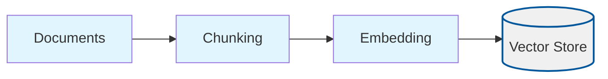
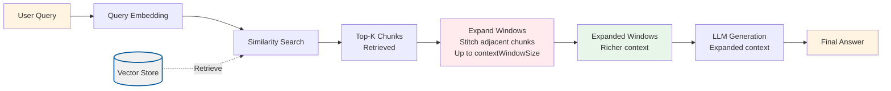

# Context Window (Context Window Enhancement)

## Overview

This project implements **Context Window Enhancement**, a technique that improves answer quality by expanding retrieved chunks into configurable windows of surrounding context. Instead of using only the top-K retrieved chunks, the system stitches adjacent chunks around each retrieved hit to provide richer, more complete context windows.

Context Window Enhancement addresses a fundamental problem in RAG systems: **retrieved chunks may miss important surrounding context**. When we retrieve top-K chunks based on similarity, we get the most relevant pieces, but we may miss:
- Important context immediately before or after the retrieved chunk
- Related information in adjacent chunks from the same document
- Complete thoughts or explanations that span multiple chunks

By expanding context windows around retrieved chunks, we:
- Provide more complete context to the LLM
- Capture surrounding information that may be relevant
- Improve answer completeness without inflating topK
- Maintain document structure and flow

## What Makes This Project Unique

**Context Window Enhancement** introduces **configurable context expansion** as a context enrichment technique:

- **Window Expansion**: Expands each retrieved chunk into a larger window by stitching adjacent chunks from the same document
- **Configurable Size**: The `contextWindowSize` parameter controls how large the expanded windows can be
- **Efficient Expansion**: Uses the same stitching algorithm as relevant-segments but with larger window sizes
- **No TopK Inflation**: Provides richer context without needing to retrieve more chunks (which would increase noise)

### How the Unique Concepts Work

1. **Window Expansion**: After retrieving top-K chunks, the system:
   - Groups chunks by `documentId` (chunks from the same document)
   - Sorts chunks by `index` within each document group
   - Expands each retrieved chunk by stitching adjacent chunks (consecutive indices) from the same document
   - Stops expanding when the window would exceed `contextWindowSize` characters
   - Creates expanded windows that provide surrounding context

2. **Window Size Control**: The `contextWindowSize` parameter (default: 1200) ensures:
   - Windows are large enough to provide rich context
   - Windows don't exceed prompt limits
   - Balance between context richness and token efficiency
   - Typically larger than `chunkSize` to include surrounding chunks

3. **Expansion Process**: When chunks are expanded:
   - Adjacent chunks from the same document are merged
   - Content is combined with `\n\n` (double newline) separator
   - The highest similarity score from merged chunks is preserved
   - The expanded window represents a longer, more complete piece of text

### How to Adjust for Different Use Cases

- **For richer context**: Increase `contextWindowSize` (e.g., 1600-2000) to allow larger expanded windows
- **For tighter prompts**: Decrease `contextWindowSize` (e.g., 1000-1200) to keep windows smaller
- **For better expansion**: Increase `topK` to retrieve more chunks, giving more opportunities for expansion
- **For chunk size tuning**: Adjust `chunkSize` and `chunkOverlap` - more overlap means more adjacent chunks available for expansion

## Process Diagrams

Context Window Enhancement expands retrieved chunks into larger windows:

### Ingestion Process

The ingestion process follows the standard RAG pattern:



### Query Process with Window Expansion



## Configuration

The project is configured via `config/context-window.config.json`:

```json
{
  "chunkSize": 800,
  "chunkOverlap": 200,
  "topK": 4,
  "embeddingModel": "text-embedding-3-small",
  "chatModel": "gpt-4o-mini",
  "dataPath": "../../shared/assets/data",
  "indexPath": ".tmp/index/context-window.index.json",
  "contextWindowSize": 1200
}
```

### Configuration Parameters Explained

**Standard RAG Parameters** (same as basic-rag):
- `chunkSize`: Characters per chunk (default: 800)
- `chunkOverlap`: Overlap between chunks (default: 200)
- `topK`: Number of chunks to retrieve before expansion (default: 4)
- `embeddingModel`: OpenAI embedding model (default: "text-embedding-3-small")
- `chatModel`: LLM for answer generation (default: "gpt-4o-mini")
- `dataPath`: Path to documents directory (default: "../../shared/assets/data")
- `indexPath`: Path to vector index file (default: ".tmp/index/context-window.index.json")

**Context Window Specific Parameters**:
- `contextWindowSize`: Maximum characters per expanded window (default: 1200)
  - Controls how large expanded windows can be
  - Should be larger than `chunkSize` to include surrounding chunks
  - Range: 1000-2000 characters recommended
  - Larger values = richer context but more tokens
  - Smaller values = tighter prompts but potentially less context

### Runtime Data Directory (`.tmp/`)

- Generated artifacts (vector indexes) are written to the project-local `.tmp/` directory
- The directory is committed (via `.gitkeep`) so contributors know where runtime files belong, but contents are ignored via `.gitignore`
- Deleting `.tmp/` is safe; `pnpm run ingest` will recreate the files

## Setup

1. **Install dependencies** (from repository root):
   ```bash
   pnpm install
   ```

2. **Set up environment variables**:
   Create a `.env` file at the repository root with:
   ```bash
   OPENAI_API_KEY=your-api-key-here
   ```

3. **Prepare sample data**:
   The project uses sample data from `shared/assets/data/` by default (configured via `dataPath`). You can modify `dataPath` to point to your own document directory.

## Usage

### Step 1: Ingest Documents

This script reads documents, chunks them, generates embeddings, and stores them in a vector index. The ingestion process is identical to basic-rag (no expansion during ingestion).

```bash
cd projects/context-window
pnpm run ingest
```

**What happens during ingestion:**
1. Loads configuration from `config/context-window.config.json`
2. Reads all `.txt` and `.md` files from the directory specified in `dataPath` (default: `shared/assets/data/`)
3. Splits documents into chunks with configurable size and overlap
4. Generates embeddings for each chunk using the specified embedding model
5. Stores chunks and embeddings in a vector store
6. Persists the vector store to `.tmp/index/context-window.index.json`

**Expected output:**
```
{"level":"info","message":"Loading config",...}
{"level":"info","message":"Reading documents",...}
{"level":"info","message":"Loaded documents","meta":{"count":1}}
{"level":"info","message":"Created chunks","meta":{"count":625}}
{"level":"info","message":"Persisted vector index",...}
```

### Step 2: Query with Window Expansion

This script loads the vector index and provides an interactive CLI for asking questions with context window expansion.

```bash
cd projects/context-window
pnpm run query
```

**What happens during querying:**
1. Loads the vector index from the persisted file
2. Initializes embedding and chat clients
3. Enters an interactive loop:
   - Prompts for a question
   - Embeds the question into a vector
   - Searches the vector store for the top-K most similar chunks
   - **Expands each retrieved chunk** into a larger window by stitching adjacent chunks
   - Constructs a prompt with the expanded windows (instead of individual chunks)
   - Sends the prompt to the LLM for answer generation
   - Displays the answer

**Example interaction:**
```
> What is Nike's revenue strategy?
```

The system will:
1. Retrieve the 4 most relevant chunks
2. Expand each chunk into a larger window (up to `contextWindowSize` characters) by including adjacent chunks
3. Generate an answer based on the expanded windows
4. Display the answer

**Key Difference**: The prompt contains expanded windows with surrounding context instead of isolated chunks, providing more complete context to the LLM.

Type `exit` to quit the interactive session.

### Validation Scenario

To verify that ingestion and querying work correctly, use this validation scenario:

**Setup**: Ensure you have ingested documents (run `pnpm run ingest`).

**Test Query**: "What is Nike's revenue strategy?"

**Expected Behavior**:
1. The system should retrieve relevant chunks from the Nike annual report (default sample document)
2. Each retrieved chunk should be expanded into a larger window by including adjacent chunks
3. The logs should show:
   - Query embedding generation
   - Retrieval results (number of chunks retrieved)
   - Window expansion results (expanded windows should be longer than original chunks)
   - Answer generation status
4. The answer should mention revenue-related strategies from the document
5. Expanded windows should provide richer context than individual chunks

**Verification**: Check the logs for:
- Retrieval scores and chunk counts
- Window expansion results (expanded window lengths)
- Answer generation status
- The answer should be grounded in the retrieved document content
- Compare window lengths: expanded windows should be longer than individual chunks

## Expected Outcomes

### After Ingestion

- A vector index file is created at `.tmp/index/context-window.index.json`
- The file contains all document chunks with their embeddings
- No expansion is applied during ingestion (expansion happens at query time)

### During Querying

- **Expanded Windows**: Retrieved chunks are expanded into larger windows with surrounding context
- **Richer Context**: Windows provide more complete context than isolated chunks
- **Better Answers**: Answers should be more complete and better grounded due to expanded context
- **Surrounding Information**: Windows include adjacent chunks that may contain relevant context

### Example Queries and Expected Behavior

**Query**: "What is the main topic of the document?"
- **Expected**: Retrieves chunks containing overview content, expands them into larger windows
- **Answer**: Should summarize the document's main themes with better completeness due to expanded context

**Query**: "What are the key financial metrics?"
- **Expected**: Retrieves chunks with financial data, expands them to include surrounding context
- **Answer**: Should list specific metrics with better context preservation

**Query**: "What is the weather today?"
- **Expected**: Retrieves chunks (if any) but they won't be relevant
- **Answer**: Should indicate that the information is not available in the provided context

**Key Benefit**: Compared to basic-rag, answers should be more complete due to expanded context windows that include surrounding information.

## Understanding the Code

### Key Components

1. **`src/ingest.ts`**: Document ingestion pipeline
   - Standard ingestion process (no expansion during ingestion)
   - Reuses basic-rag ingestion logic
   - Creates vector index for retrieval

2. **`src/query.ts`**: Query pipeline with window expansion
   - `answerQuestion()`: Main query function that applies window expansion
   - Uses `stitchRetrievedChunks()` from shared utilities with `contextWindowSize` parameter
   - Builds prompt with expanded windows instead of individual chunks
   - Generates answer using richer context

3. **Shared Utilities** (in `shared/typescript/utils/`):
   - `evaluation.ts`: Contains `stitchRetrievedChunks()` function
     - Groups chunks by document
     - Merges consecutive chunks from the same document
     - Respects `contextWindowSize` limit (larger than relevant-segments default)
   - `vectorStore.ts`: Vector storage and similarity search
   - `llm.ts`: OpenAI client wrappers for embeddings and chat
   - `config.ts`: Configuration loading and validation
   - `types.ts`: TypeScript type definitions

### How It Works: The Window Expansion Pipeline

```
Query → Embedding → Similarity Search → Top-K Chunks → Expand Windows → Expanded Windows → LLM Generation → Answer
```

1. **Retrieval**: Standard semantic similarity search retrieves top-K chunks
2. **Grouping**: Chunks are grouped by `documentId` and sorted by `index`
3. **Expansion**: Each retrieved chunk is expanded by stitching adjacent chunks:
   - Adjacent chunks from the same document are merged
   - Content is combined with `\n\n` separator
   - Highest similarity score is preserved
   - Expansion stops when window would exceed `contextWindowSize`
4. **Answer Generation**: LLM generates answer using expanded windows (richer context)

**Key Insight**: By expanding retrieved chunks into larger windows, we capture surrounding context that may be relevant to answering the query, leading to more complete answers.

## Troubleshooting

### "OPENAI_API_KEY is not set"
- Ensure you have a `.env` file at the repository root with your API key
- The `loadEnv()` function should automatically find and load it

### "Config file not found"
- Ensure `config/context-window.config.json` exists in the project directory
- Or set `RAG_CONFIG_PATH` environment variable to point to your config

### "Vector index file not found"
- Run `pnpm run ingest` first to create the index
- Check that `indexPath` in config points to the correct location

### Windows are not expanding
- Ensure retrieved chunks are from the same document and have adjacent indices
- Increase `topK` to retrieve more chunks, increasing chances of adjacent chunks
- Check that `chunkOverlap` is sufficient to create adjacent chunks during ingestion

### Windows are too long
- Decrease `contextWindowSize` to limit window size
- Or decrease `topK` to retrieve fewer chunks

### Windows are too short (not enough expansion)
- Increase `contextWindowSize` to allow larger expanded windows
- Increase `topK` to retrieve more chunks (more opportunities for expansion)
- Increase `chunkOverlap` during ingestion to create more adjacent chunks

### Poor retrieval quality
- Try adjusting `chunkSize` and `chunkOverlap` in the config
- Increase `topK` to retrieve more chunks
- Consider using a larger embedding model

### Answers not grounded in context
- Check the similarity scores of retrieved chunks (lower scores = less relevant)
- Verify your documents contain information relevant to the query
- The LLM prompt instructs it to say "I don't know" if context is insufficient
- Window expansion should help by providing richer context

## Related Projects

- **`basic-rag`**: Baseline RAG without expansion (compare results)
- **`relevant-segments`**: Stitches adjacent chunks (similar but with smaller default segment size)
- **`contextual-compression`**: Compresses retrieved context (can be combined with window expansion)

## Next Steps

After understanding context window enhancement, explore other context enrichment techniques:
- **`relevant-segments`**: Stitches adjacent chunks into segments
- **`contextual-compression`**: Compresses retrieved context before answering
- **`chunk-headers`**: Adds contextual headers to chunks before embedding

Each technique addresses different aspects of improving retrieval and answer quality.
