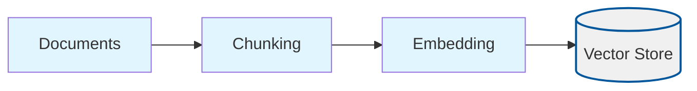
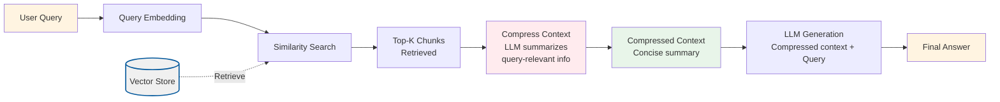

# Contextual Compression

## Overview

This project implements **Contextual Compression**, a technique that improves retrieval quality by compressing and filtering retrieved chunks before passing them to the LLM for answer generation. Instead of using all retrieved chunks directly, the system uses an LLM to extract only the most relevant information from the chunks in the context of the user's query.

Contextual Compression addresses a fundamental problem in RAG systems: **retrieved chunks often contain irrelevant information**. When we retrieve top-K chunks, they may include:
- Information that's semantically similar but not directly relevant to the specific question
- Redundant information repeated across multiple chunks
- Noise and extraneous details that don't help answer the query

By compressing retrieved context with an LLM before answering, we:
- Reduce token usage (saving costs)
- Remove noise and irrelevant information
- Preserve answer-critical facts
- Provide more focused context to the final answer generation step

## What Makes This Project Unique

**Contextual Compression** introduces **post-retrieval compression** as a quality enhancement technique:

- **LLM-Based Compression**: Uses an LLM to intelligently summarize and filter retrieved chunks, keeping only information relevant to the query
- **Query-Aware Filtering**: Compression is performed in the context of the specific user query, ensuring only relevant information is preserved
- **Token Efficiency**: Reduces prompt size by compressing multiple chunks into concise, focused summaries
- **Fact Preservation**: The compression process is instructed to preserve answer-critical facts while removing noise

### How the Unique Concepts Work

1. **Compression Process**: After retrieving top-K chunks using standard semantic similarity search, the system:
   - Takes the user's query and all retrieved chunks
   - Uses an LLM to generate a concise summary that:
     - Keeps only details needed to answer the question
     - Removes irrelevant information
     - Preserves facts and key information
     - Uses bullet-style notes for efficiency
   - The compressed summary replaces the original chunks in the prompt

2. **Compression Prompt**: The LLM is instructed to:
   - Write a concise, self-contained summary
   - Keep only details needed to answer the question
   - Use notes style (bullet points) over long narrative
   - Not invent new facts
   - Focus on query-relevant information

3. **Two-Stage Process**: 
   - **Stage 1**: Standard retrieval (embed query, find top-K chunks)
   - **Stage 2**: Compression (LLM summarizes retrieved chunks in context of query)
   - **Stage 3**: Answer generation (LLM generates answer from compressed context)

### How to Adjust for Different Use Cases

- **For better compression quality**: Use a stronger model like `gpt-4o` for the chat model (though this increases cost)
- **For cost efficiency**: Use `gpt-4o-mini` for compression (default), which still provides good quality
- **For more comprehensive compression**: Increase `topK` to retrieve more chunks before compression (gives compression more context to work with)
- **For tighter compression**: The compression prompt is already optimized for conciseness, but you can adjust it in `shared/typescript/utils/llm.ts` if needed
- **For better recall**: Increase `topK` before compression to ensure important information isn't lost during the compression step

## Process Diagrams

Contextual Compression adds a compression step between retrieval and answer generation:

### Ingestion Process

The ingestion process follows the standard RAG pattern (no compression during ingestion):



### Query Process with Compression



## Configuration

The project is configured via `config/contextual-compression.config.json`:

```json
{
  "chunkSize": 800,
  "chunkOverlap": 200,
  "topK": 4,
  "embeddingModel": "text-embedding-3-small",
  "chatModel": "gpt-4o-mini",
  "dataPath": "../../shared/assets/data",
  "indexPath": ".tmp/index/contextual-compression.index.json"
}
```

### Configuration Parameters Explained

**Standard RAG Parameters** (same as basic-rag):
- `chunkSize`: Characters per chunk (default: 800)
- `chunkOverlap`: Overlap between chunks (default: 200)
- `topK`: Number of chunks to retrieve before compression (default: 4)
  - More chunks = more context for compression, but also more initial noise
  - Recommended: 4-6 for most use cases
- `embeddingModel`: OpenAI embedding model (default: "text-embedding-3-small")
- `chatModel`: LLM for both compression and answer generation (default: "gpt-4o-mini")
  - This model is used for both compressing context and generating final answers
  - Use `gpt-4o` for better quality (but higher cost)
- `dataPath`: Path to documents directory (default: "../../shared/assets/data")
- `indexPath`: Path to vector index file (default: ".tmp/index/contextual-compression.index.json")

**No Special Parameters Required**: Compression uses the same `chatModel` as answer generation. The compression behavior is controlled by the prompt in `shared/typescript/utils/llm.ts`.

### Runtime Data Directory (`.tmp/`)

- Generated artifacts (vector indexes) are written to the project-local `.tmp/` directory
- The directory is committed (via `.gitkeep`) so contributors know where runtime files belong, but contents are ignored via `.gitignore`
- Deleting `.tmp/` is safe; `pnpm run ingest` will recreate the files

## Setup

1. **Install dependencies** (from repository root):
   ```bash
   pnpm install
   ```

2. **Set up environment variables**:
   Create a `.env` file at the repository root with:
   ```bash
   OPENAI_API_KEY=your-api-key-here
   ```

3. **Prepare sample data**:
   The project uses sample data from `shared/assets/data/` by default (configured via `dataPath`). You can modify `dataPath` to point to your own document directory.

## Usage

### Step 1: Ingest Documents

This script reads documents, chunks them, generates embeddings, and stores them in a vector index. The ingestion process is identical to basic-rag (no compression during ingestion).

```bash
cd projects/contextual-compression
pnpm run ingest
```

**What happens during ingestion:**
1. Loads configuration from `config/contextual-compression.config.json`
2. Reads all `.txt` and `.md` files from the directory specified in `dataPath` (default: `shared/assets/data/`)
3. Splits documents into chunks with configurable size and overlap
4. Generates embeddings for each chunk using the specified embedding model
5. Stores chunks and embeddings in a vector store
6. Persists the vector store to `.tmp/index/contextual-compression.index.json`

**Expected output:**
```
{"level":"info","message":"Loading config",...}
{"level":"info","message":"Reading documents",...}
{"level":"info","message":"Loaded documents","meta":{"count":1}}
{"level":"info","message":"Created chunks","meta":{"count":625}}
{"level":"info","message":"Persisted vector index",...}
```

### Step 2: Query with Compression

This script loads the vector index and provides an interactive CLI for asking questions with contextual compression.

```bash
cd projects/contextual-compression
pnpm run query
```

**What happens during querying:**
1. Loads the vector index from the persisted file
2. Initializes embedding and chat clients
3. Enters an interactive loop:
   - Prompts for a question
   - Embeds the question into a vector
   - Searches the vector store for the top-K most similar chunks
   - **Compresses the retrieved chunks** using an LLM (extracts query-relevant information)
   - Constructs a prompt with the **compressed context** (not the original chunks)
   - Sends the prompt to the LLM for answer generation
   - Displays the answer

**Example interaction:**
```
> What is Nike's revenue strategy?
```

The system will:
1. Retrieve the 4 most relevant chunks from the ingested documents
2. Compress those chunks into a concise summary focused on revenue strategy
3. Generate an answer based on the compressed context
4. Display the answer

**Key Difference**: The prompt sent to the LLM contains a compressed summary instead of the full retrieved chunks, reducing token usage and noise.

Type `exit` to quit the interactive session.

### Validation Scenario

To verify that ingestion and querying work correctly, use this validation scenario:

**Setup**: Ensure you have ingested documents (run `pnpm run ingest`).

**Test Query**: "What is Nike's revenue strategy?"

**Expected Behavior**:
1. The system should retrieve relevant chunks from the Nike annual report (default sample document)
2. The compression step should create a concise summary of the retrieved chunks focused on revenue strategy
3. The logs should show:
   - Query embedding generation
   - Retrieval results (number of chunks, similarity scores)
   - Compression step (compressed context length)
   - Answer generation status
4. The answer should mention revenue-related strategies from the document
5. The compressed context should be shorter than the original chunks but preserve key facts

**Verification**: Check the logs for:
- Retrieval scores and chunk counts
- Compression step execution (compressed context should be logged)
- Answer generation status
- The answer should be grounded in the compressed document content
- Compare token usage: compressed context should use fewer tokens than original chunks

## Expected Outcomes

### After Ingestion

- A vector index file is created at `.tmp/index/contextual-compression.index.json`
- The file contains all document chunks with their embeddings
- No compression is applied during ingestion (compression happens at query time)

### During Querying

- **Compressed Context**: Retrieved chunks are compressed into concise summaries before answer generation
- **Reduced Token Usage**: The prompt uses compressed context instead of full chunks, reducing token costs
- **Focused Answers**: Answers should be more focused and relevant due to noise removal during compression
- **Fact Preservation**: Key facts should be preserved in the compressed context

### Example Queries and Expected Behavior

**Query**: "What are the key financial metrics?"
- **Expected**: Retrieves chunks with financial data, compresses to extract only metric-related information
- **Answer**: Should list specific metrics mentioned in the documents, with less noise from surrounding text

**Query**: "What is the main topic of the document?"
- **Expected**: Retrieves overview chunks, compresses to extract main themes
- **Answer**: Should summarize the document's main themes concisely

**Query**: "What is the weather today?"
- **Expected**: Retrieves chunks (if any) but they won't be relevant
- **Answer**: Should indicate that the information is not available in the provided context

**Key Benefit**: Compared to basic-rag, answers should be more focused and use fewer tokens, while maintaining accuracy.

## Understanding the Code

### Key Components

1. **`src/ingest.ts`**: Document ingestion pipeline
   - Standard ingestion process (no compression during ingestion)
   - Reuses basic-rag ingestion logic
   - Creates vector index for retrieval

2. **`src/query.ts`**: Query pipeline with compression
   - `answerQuestion()`: Main query function that applies compression
   - Uses `compressRetrievedContext()` from shared utilities to compress chunks
   - Builds prompt with compressed context instead of original chunks
   - Generates answer using compressed context

3. **Shared Utilities** (in `shared/typescript/utils/`):
   - `llm.ts`: Contains `compressRetrievedContext()` and `buildCompressionMessages()` functions
     - `buildCompressionMessages()`: Creates the compression prompt
     - `compressRetrievedContext()`: Executes compression using LLM
   - `vectorStore.ts`: Vector storage and similarity search
   - `config.ts`: Configuration loading and validation
   - `types.ts`: TypeScript type definitions

### How It Works: The Compression Pipeline

```
Query → Embedding → Similarity Search → Top-K Chunks → Compression (LLM) → Compressed Context → LLM Generation → Answer
```

1. **Retrieval**: Standard semantic similarity search retrieves top-K chunks
2. **Compression**: LLM is prompted to:
   - Read the user's question
   - Review all retrieved chunks
   - Extract only information relevant to answering the question
   - Create a concise summary (bullet-style notes)
3. **Answer Generation**: LLM generates answer using the compressed context (not original chunks)
4. **Result**: More focused answer with reduced token usage

**Key Insight**: By compressing retrieved context in the context of the query, we remove noise and irrelevant information while preserving answer-critical facts, leading to better answers and lower costs.

## Troubleshooting

### "OPENAI_API_KEY is not set"
- Ensure you have a `.env` file at the repository root with your API key
- The `loadEnv()` function should automatically find and load it

### "Config file not found"
- Ensure `config/contextual-compression.config.json` exists in the project directory
- Or set `RAG_CONFIG_PATH` environment variable to point to your config

### "Vector index file not found"
- Run `pnpm run ingest` first to create the index
- Check that `indexPath` in config points to the correct location

### Compression removes important information
- Increase `topK` to retrieve more chunks before compression (gives compression more context)
- The compression prompt is designed to preserve facts, but if information is lost, try retrieving more chunks

### Answers are less accurate than basic-rag
- Compression may occasionally remove important context
- Try increasing `topK` to give compression more information to work with
- Consider using a stronger model (`gpt-4o`) for compression if quality is critical

### Compression is slow
- Compression requires an additional LLM call per query
- Use `gpt-4o-mini` for faster compression (default)
- Consider the trade-off: compression improves quality and reduces token usage, but adds latency

### Poor retrieval quality
- Try adjusting `chunkSize` and `chunkOverlap` in the config
- Increase `topK` to retrieve more chunks (compression will filter them)
- Consider using a larger embedding model

### Answers not grounded in context
- Check the similarity scores of retrieved chunks (lower scores = less relevant)
- Verify your documents contain information relevant to the query
- The LLM prompt instructs it to say "I don't know" if context is insufficient
- Compression should help by focusing on relevant information

## Related Projects

- **`basic-rag`**: Baseline RAG without compression (compare results and token usage)
- **`relevant-segments`**: Stitches adjacent chunks into longer segments (can be combined with compression)
- **`context-window`**: Expands context around retrieved chunks (compression can help reduce expanded context size)

## Next Steps

After understanding contextual compression, explore other context enrichment techniques:
- **`relevant-segments`**: Stitches adjacent chunks into longer segments
- **`context-window`**: Expands context around retrieved chunks
- **`chunk-headers`**: Adds contextual headers to chunks before embedding

Each technique addresses different aspects of improving retrieval and answer quality.
