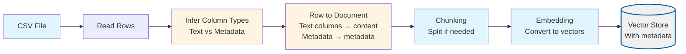
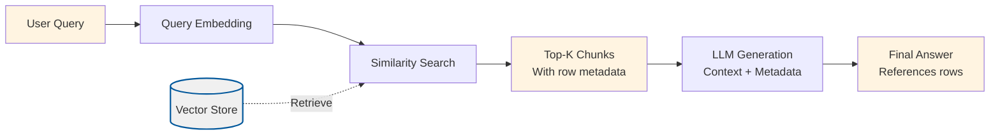

# CSV RAG (Structured Retrieval)

CSV RAG ports the “simple CSV RAG” notebook from the original NirDiamant repository into a fully typed Node.js project. Instead of splitting free-form documents, it:

1. Loads structured rows from a CSV file
2. Infers which columns contain descriptive text vs. metadata
3. Converts every row into a chunk-friendly document
4. Embeds those chunks and stores them in a vector index
5. Answers questions with an interactive CLI that surfaces both the text column content and the original row metadata

It is ideal whenever you have lightweight tabular exports (finance summaries, experiment trackers, product roadmaps) and you want transparent answers that show which row was used.

## What Makes This Project Unique

**CSV RAG** extends basic RAG to handle structured tabular data. Its uniqueness lies in:

- **Automatic column inference**: Automatically detects which CSV columns contain searchable text vs. structured metadata, eliminating the need to manually specify column types for most CSVs.
- **Dual-purpose columns**: Text columns are embedded and searched semantically, while metadata columns are preserved for filtering, display, and structured queries without being embedded.
- **Row-to-document mapping**: Each CSV row becomes a document, making it easy to trace answers back to specific rows and their metadata.

### How the Unique Concepts Work

1. **Column type inference**: The system analyzes CSV rows to determine which columns contain alphabetic characters (text) vs. purely numeric/categorical data (metadata). This is controlled by the `inferTextColumns()` function, which can be overridden via `textColumns` in the config.

2. **Content + metadata separation**: Text columns are formatted as "ColumnName: value" and embedded, while metadata columns are stored separately in chunk metadata. This allows semantic search over text while preserving structured data for programmatic use.

3. **Metadata preservation**: During retrieval, both the embedded text content and the original row metadata are available, allowing the LLM to reference specific values (e.g., "Company X had revenue of $1M in 2023") and enabling post-retrieval filtering.

### How to Adjust for Different Use Cases

- **For CSVs with mixed text/numeric columns**: Let auto-inference work, or manually specify `textColumns` if the heuristic misclassifies (e.g., if a numeric column like "Year" should be searchable text).

- **For CSVs with many metadata columns**: Explicitly set `metadataColumns` to control which columns are shown during querying, reducing noise in the prompt.

- **For very wide CSVs**: Consider specifying only the most important text columns in `textColumns` to focus embedding on the most relevant content and reduce token usage.

- **For CSVs with long text fields**: Adjust `chunkSize` and `chunkOverlap` to handle multi-paragraph notes or descriptions within single rows.

## Process Diagrams

CSV RAG differs from basic RAG in its ingestion process. Here's how it works:

### Ingestion Process



### Query Process

The query process follows the standard RAG pattern but preserves and displays CSV metadata:



## Configuration

All settings live in `config/csv-rag.config.json`:

| Field | Description |
| --- | --- |
| `chunkSize` / `chunkOverlap` | Controls how each synthesized row document is chunked. Larger chunks preserve more context; higher overlap reduces boundary loss. |
| `topK` | Number of chunks to retrieve per query. |
| `embeddingModel` / `chatModel` | OpenAI models used for embeddings and generation. |
| `dataPath` | Path to documents directory (default: `../../shared/assets/data`). |
| `indexPath` | Where the serialized vector store is written (always under `.tmp/`). |
| `csvPath` | Absolute or relative path to the CSV file that should be ingested (relative to config file or absolute path). |
| `textColumns` | Optional list of columns that should become the chunk body. When omitted, the ingest pipeline auto-selects columns that contain alphabetic characters. |
| `metadataColumns` | Optional list of columns to keep as metadata (displayed during querying). Defaults to “all other columns.” |
| `delimiter` | Override when your CSV uses `;` or `\t`. Defaults to `,`. |

Example (shipped in this repo):

```json
{
  "chunkSize": 800,
  "chunkOverlap": 200,
  "topK": 4,
  "embeddingModel": "text-embedding-3-small",
  "chatModel": "gpt-4o-mini",
  "dataPath": "../../shared/assets/data",
  "indexPath": ".tmp/index/csv-rag.index.json",
  "csvPath": "../../shared/assets/data/unicorn_companies_metrics.csv",
  "textColumns": ["Notes"],
  "metadataColumns": ["Year", "Category", "Metric"],
  "delimiter": ","
}
```

## Sample Data

The default configuration uses `shared/assets/data/unicorn_companies_metrics.csv`. You can modify `csvPath` in the config to use your own CSV file. The CSV must contain a header row with column names.

### Runtime Data Directory (`.tmp/`)

- Generated artifacts (vector indexes) are written to the project-local `.tmp/` directory
- The directory is committed (via `.gitkeep`) so contributors know where runtime files belong, but contents are ignored via `.gitignore`
- Deleting `.tmp/` is safe; `pnpm run ingest` will recreate the files

## Setup

From the repository root:

```bash
pnpm install
export OPENAI_API_KEY=sk-your-key
```

Inside this project:

```bash
cd projects/csv-rag
pnpm run ingest
pnpm run query
```

## What happens during ingestion?

1. `.env` / environment variables are loaded to access the OpenAI API key.
2. The CSV config is validated (`csvPath`, `textColumns`, etc.).
3. Rows are read via the shared CSV helper (handles quoted commas and escaped quotes).
4. Text vs. metadata columns are inferred when not specified.
5. Each row becomes a `Document` whose `content` is the joined text columns and whose metadata keeps contextual fields (year, metric, etc.).
6. Documents are chunked using the shared `simpleChunkDocument` helper.
7. Embeddings + chunks are written to `.tmp/index/csv-rag.index.json`.

Console output resembles:

```
{"level":"info","message":"CSV stats","meta":{"csvPath":".../unicorn_companies_metrics.csv","rowCount":X,"textColumns":[...],"metadataColumns":[...]}}
{"level":"info","message":"CSV ingestion complete","meta":{"indexPath":"/.../.tmp/index/csv-rag.index.json"}}
```

## Query CLI

Run `pnpm run query`, ask questions, and type `exit` to quit. The CLI:

1. Loads the serialized vector index.
2. Embeds the incoming question.
3. Retrieves the top `k` chunks (rows) and prints their similarity scores plus metadata.
4. Builds a prompt instructing the LLM to answer strictly with CSV evidence.
5. Prints the grounded answer.

Example interaction:

```
> Where did revenue grow?

Answer:
Revenue grew to $51B according to the finance category row for 2023, which attributes growth to North America and digital channels.
```

### Validation Scenario

To verify that ingestion and querying work correctly, use this validation scenario:

**Setup**: Ensure you have ingested the CSV (run `pnpm run ingest`).

**Test Query**: "What companies are in the dataset?" or "Tell me about the companies in the CSV"

**Expected Behavior**:
1. The system should retrieve relevant rows from the CSV
2. The answer should mention specific companies or metrics from the CSV
3. Metadata (like company names, values, categories) should be included in the answer
4. Similarity scores should be logged for retrieved chunks

**Verification**: Check the logs for:
- CSV ingestion stats (row count, text columns detected, metadata columns)
- Retrieval scores and chunk counts
- Answer generation status
- The answer should reference specific CSV data with metadata context

## Testing

Unit tests cover ingestion utilities (column inference, document construction, dependency orchestration) and query helpers. Run them with:

```bash
pnpm --filter csv-rag test
```

## Understanding the Code

### Key Components

1. **`src/ingest.ts`**: CSV ingestion pipeline
   - Reads CSV file and parses rows using shared CSV utilities
   - Infers or uses configured text/metadata columns
   - Converts each row into a Document with content from text columns and metadata from other columns
   - Chunks documents using standard chunking algorithm
   - Generates embeddings and stores them in the vector index

2. **`src/query.ts`**: Interactive query interface
   - Loads the vector index with embedded row data
   - Retrieves relevant chunks (rows) based on semantic similarity
   - Formats retrieved chunks with their metadata for display
   - Generates answers using LLM with both text content and metadata context

3. **Shared Utilities** (in `shared/typescript/utils/`):
   - `csv.ts`: CSV parsing utilities with support for quoted fields and custom delimiters
   - `vectorStore.ts`: Vector storage and similarity search
   - `llm.ts`: OpenAI client wrappers for embeddings and chat
   - `config.ts`: Configuration loading and validation
   - `documents.ts`: Document type definitions and row-to-document conversion

### Algorithm Overview

**CSV Ingestion Pipeline**:
1. **Parse CSV**: Read CSV file and extract rows with headers
2. **Classify Columns**: Automatically infer text columns (alphabetic content) vs metadata columns (numeric/categorical), or use configured columns
3. **Create Documents**: Each row becomes a Document where:
   - Text columns are joined into the document content
   - Metadata columns are stored in document metadata
4. **Chunk**: Split row documents into chunks if they exceed chunk size
5. **Embed**: Generate embeddings for each chunk
6. **Store**: Save chunks with embeddings and metadata to vector index

**CSV Query Pipeline**:
1. **Query**: User asks a natural language question
2. **Embed**: Convert query to vector embedding
3. **Retrieve**: Find top-K most similar row chunks using cosine similarity
4. **Format**: Include both text content and metadata in the prompt context
5. **Generate**: LLM generates answer referencing specific rows and their metadata

**Key Insight**: By separating text content (for embedding/search) from metadata (for filtering/display), CSV RAG enables semantic search while preserving structured data relationships.

## Troubleshooting

| Symptom | Fix |
| --- | --- |
| “Unable to determine text columns” | Set `textColumns` explicitly in the config. |
| “CSV file not found” | Ensure `csvPath` is relative to `projects/csv-rag` or provide an absolute path. |
| CLI answers “I don't know based on the CSV” | The retrieved rows did not contain the answer; verify your CSV content or increase `topK`. |

## Extending

- Add additional metadata columns to show more context during querying.
- Generate multiple per-row documents by splitting long notes into sections before chunking.
- Swap in a different delimiter (e.g., `;`) via the config to ingest European exports.
