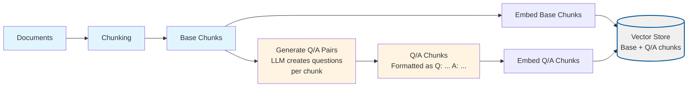
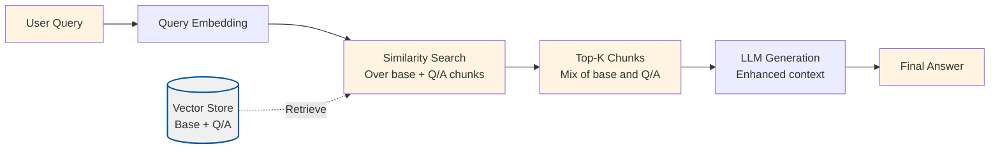

# Document Augmentation (Question Generation)

## Overview

This project implements **Document Augmentation via Question Generation**, a technique that improves retrieval quality by generating synthetic question/answer pairs for each chunk during ingestion and storing them alongside base chunks. This allows the system to retrieve over both the original chunks and the generated Q/A pairs, improving query coverage and recall.

Document Augmentation addresses a fundamental problem in RAG systems: **queries may not match how information is written in documents**. When users ask questions, they use question-like language, but documents are written in statement form. This creates a semantic gap that can reduce retrieval quality.

By generating synthetic Q/A pairs during ingestion, we:
- Create question-answer representations of document content
- Enable question-question matching at query time (better semantic alignment)
- Improve recall by providing multiple ways to retrieve the same information
- Increase query coverage by matching both base chunks and Q/A pairs

## What Makes This Project Unique

**Document Augmentation** introduces **offline Q/A generation** and **dual retrieval**:

- **Synthetic Q/A Generation**: During ingestion, each chunk is analyzed by an LLM to generate multiple question/answer pairs that the chunk can answer
- **Dual Storage**: Both base chunks and generated Q/A chunks are embedded and stored in the vector index
- **Enhanced Retrieval**: At query time, retrieval searches over both base chunks and Q/A chunks, improving the chances of finding relevant information
- **Metadata Tracking**: Q/A chunks are marked with `augmentation: "qa"` metadata to distinguish them from base chunks

### How the Unique Concepts Work

1. **Q/A Generation Process**: During ingestion, for each document chunk:
   - An LLM is prompted to generate `questionsPerChunk` diverse questions that can be answered from the chunk
   - The LLM returns JSON with question/answer pairs
   - Each Q/A pair is formatted as `Q: [question]\nA: [answer]`
   - Q/A chunks are created with metadata linking back to the source chunk

2. **Dual Embedding**: Both types of chunks are embedded:
   - **Base chunks**: Original document chunks (same as basic-rag)
   - **Q/A chunks**: Generated question/answer pairs
   - Both are stored in the same vector index
   - Both are searchable during retrieval

3. **Enhanced Retrieval**: During querying:
   - User query is embedded
   - Vector search retrieves top-K chunks from the combined set (base + Q/A)
   - Q/A chunks may match better because questions match questions (better semantic alignment)
   - Base chunks provide original document context
   - The LLM receives both types of chunks in the context

### How to Adjust for Different Use Cases

- **For better Q/A quality**: Use a stronger model like `gpt-4o` for `chatModel` to generate more accurate and relevant questions
- **For cost efficiency**: Use `gpt-4o-mini` for Q/A generation (default)
- **For better coverage**: Increase `questionsPerChunk` (e.g., 4-6) to generate more Q/A pairs per chunk, but this increases ingestion cost and time
- **For faster ingestion**: Decrease `questionsPerChunk` (e.g., 2-3) to generate fewer Q/A pairs
- **For better recall**: Increase `topK` to retrieve more chunks (both base and Q/A chunks)

## Process Diagrams

Document Augmentation generates Q/A pairs during ingestion and retrieves over both base and augmented chunks:

### Ingestion Process with Q/A Generation



### Query Process with Dual Retrieval



## Configuration

The project is configured via `config/document-augmentation.config.json`:

```json
{
  "chunkSize": 800,
  "chunkOverlap": 200,
  "topK": 4,
  "embeddingModel": "text-embedding-3-small",
  "chatModel": "gpt-4o-mini",
  "dataPath": "../../shared/assets/data",
  "indexPath": ".tmp/index/document-augmentation.index.json",
  "questionsPerChunk": 3
}
```

### Configuration Parameters Explained

**Standard RAG Parameters** (same as basic-rag):
- `chunkSize`: Characters per chunk (default: 800)
- `chunkOverlap`: Overlap between chunks (default: 200)
- `topK`: Number of chunks to retrieve from the combined set (base + Q/A chunks) (default: 4)
- `embeddingModel`: OpenAI embedding model (default: "text-embedding-3-small")
- `chatModel`: LLM for both Q/A generation and answer generation (default: "gpt-4o-mini")
  - Used for generating Q/A pairs during ingestion
  - Used for generating final answers during querying
- `dataPath`: Path to documents directory (default: "../../shared/assets/data")
- `indexPath`: Path to vector index file (default: ".tmp/index/document-augmentation.index.json")

**Document Augmentation Specific Parameters**:
- `questionsPerChunk`: Number of Q/A pairs to generate per chunk (default: 3)
  - Range: 2-6 recommended
  - More questions = better coverage but slower ingestion and more storage
  - Fewer questions = faster ingestion but less coverage

### Runtime Data Directory (`.tmp/`)

- Generated artifacts (vector indexes) are written to the project-local `.tmp/` directory
- The directory is committed (via `.gitkeep`) so contributors know where runtime files belong, but contents are ignored via `.gitignore`
- Deleting `.tmp/` is safe; `pnpm run ingest` will recreate the files
- The vector index contains both base chunks and Q/A chunks

## Setup

1. **Install dependencies** (from repository root):
   ```bash
   pnpm install
   ```

2. **Set up environment variables**:
   Create a `.env` file at the repository root with:
   ```bash
   OPENAI_API_KEY=your-api-key-here
   ```

3. **Prepare sample data**:
   The project uses sample data from `shared/assets/data/` by default (configured via `dataPath`). You can modify `dataPath` to point to your own document directory.

## Usage

### Step 1: Ingest Documents with Q/A Generation

This script reads documents, chunks them, generates synthetic Q/A pairs for each chunk, embeds both base and Q/A chunks, and stores them in a vector index.

```bash
cd projects/document-augmentation
pnpm run ingest
```

**What happens during ingestion:**
1. Loads configuration from `config/document-augmentation.config.json`
2. Reads all `.txt` and `.md` files from the directory specified in `dataPath` (default: `shared/assets/data/`)
3. Splits documents into chunks with configurable size and overlap
4. Generates embeddings for base chunks
5. Stores base chunks in the vector index
6. **For each chunk**:
   - Uses an LLM to generate `questionsPerChunk` question/answer pairs
   - Formats Q/A pairs as `Q: [question]\nA: [answer]`
   - Creates Q/A chunks with metadata (`augmentation: "qa"`, `sourceChunkId`)
7. Generates embeddings for Q/A chunks
8. Stores Q/A chunks in the vector index
9. Persists the combined vector store to `.tmp/index/document-augmentation.index.json`

**Expected output:**
```
{"level":"info","message":"Loading config",...}
{"level":"info","message":"Reading documents",...}
{"level":"info","message":"Loaded documents","meta":{"count":1}}
{"level":"info","message":"Created chunks","meta":{"count":625}}
{"level":"info","message":"Generating synthetic Q/A pairs",...}
{"level":"info","message":"Generated Q/A pairs",...}
{"level":"info","message":"Persisted vector index",...}
```

**Note**: Ingestion takes longer than basic-rag because it generates Q/A pairs for each chunk. Expect 2-3x longer ingestion time depending on `questionsPerChunk`.

### Step 2: Query with Enhanced Retrieval

This script loads the vector index and provides an interactive CLI for asking questions. Retrieval searches over both base and Q/A chunks.

```bash
cd projects/document-augmentation
pnpm run query
```

**What happens during querying:**
1. Loads the vector index from the persisted file (contains both base and Q/A chunks)
2. Initializes embedding and chat clients
3. Enters an interactive loop:
   - Prompts for a question
   - Embeds the question into a vector
   - Searches the vector store for the top-K most similar chunks (from both base and Q/A chunks)
   - Constructs a prompt with the retrieved context (may include both base chunks and Q/A chunks)
   - Sends the prompt to the LLM for answer generation
   - Displays the answer

**Example interaction:**
```
> What is Nike's revenue strategy?
```

The system will:
1. Search over both base chunks and Q/A chunks
2. Retrieve the most relevant chunks (may be a mix of base and Q/A chunks)
3. Generate an answer based on the retrieved context
4. Display the answer

**Key Difference**: Retrieval can match against both original document chunks and generated Q/A pairs, improving the chances of finding relevant information.

Type `exit` to quit the interactive session.

### Validation Scenario

To verify that ingestion and querying work correctly, use this validation scenario:

**Setup**: Ensure you have ingested documents (run `pnpm run ingest`).

**Test Query**: "What is Nike's revenue strategy?"

**Expected Behavior**:
1. The system should retrieve relevant chunks from the combined set (base + Q/A chunks)
2. Retrieved chunks may include both base chunks and Q/A chunks
3. Q/A chunks should have the format `Q: [question]\nA: [answer]`
4. The answer should mention revenue-related strategies from the document
5. Similarity scores should be logged (typically 0.7-0.9 for relevant chunks)
6. The logs should show:
   - Query embedding generation
   - Retrieval results (number of chunks, mix of base and Q/A)
   - Answer generation status

**Verification**: Check the logs for:
- Q/A generation during ingestion (questions per chunk, total Q/A chunks created)
- Retrieval results (should include both base and Q/A chunks)
- Answer generation status
- The answer should be grounded in the retrieved document content
- Q/A chunks should help match question-like queries better

## Expected Outcomes

### After Ingestion

- A vector index file is created at `.tmp/index/document-augmentation.index.json`
- The file contains both base chunks and Q/A chunks with their embeddings
- Total chunks = base chunks + (base chunks × `questionsPerChunk`)
- Q/A chunks are marked with `augmentation: "qa"` metadata

### During Querying

- **Enhanced Retrieval**: Retrieval searches over both base and Q/A chunks
- **Better Matching**: Q/A chunks may match question-like queries better (question-question matching)
- **Improved Recall**: Multiple ways to retrieve the same information (base chunks and Q/A chunks)
- **Mixed Results**: Retrieved chunks may be a mix of base chunks and Q/A chunks

### Example Queries and Expected Behavior

**Query**: "What is the main topic of the document?"
- **Expected**: May retrieve Q/A chunks with questions like "What is the main topic?" or base chunks with overview content
- **Answer**: Should summarize the document's main themes

**Query**: "What are the key financial metrics?"
- **Expected**: May retrieve Q/A chunks with questions about financial metrics or base chunks with financial data
- **Answer**: Should list specific metrics mentioned in the documents

**Query**: "What is the weather today?"
- **Expected**: Retrieves chunks (if any) but they won't be relevant
- **Answer**: Should indicate that the information is not available in the provided context

**Key Benefit**: Compared to basic-rag, retrieval should have better recall because queries can match both base chunks and Q/A chunks, with Q/A chunks providing better semantic alignment for question-like queries.

## Understanding the Code

### Key Components

1. **`src/ingest.ts`**: Document ingestion pipeline with Q/A generation
   - `runIngestion()`: Orchestrates the ingestion process
   - Generates base chunks using standard chunking
   - For each chunk, generates Q/A pairs using an LLM
   - Embeds both base and Q/A chunks
   - Stores both types in the vector index

2. **`src/query.ts`**: Query pipeline with enhanced retrieval
   - `interactiveQuery()`: Main query loop that handles user input and generates answers
   - Standard retrieval process (searches over both base and Q/A chunks)
   - Retrieved chunks may include both types

3. **Shared Utilities** (in `shared/typescript/utils/`):
   - `llm.ts`: OpenAI client wrappers for embeddings and chat (used for Q/A generation)
   - `vectorStore.ts`: Vector storage and similarity search
   - `config.ts`: Configuration loading and validation
   - `types.ts`: TypeScript type definitions

### How It Works: The Augmentation Pipeline

```
Documents → Chunking → Base Chunks → Q/A Generation → Q/A Chunks
                                                              ↓
Base Chunks → Embedding → Vector Store ← Embedding ← Q/A Chunks
                                                              ↓
Query → Embedding → Similarity Search → Top-K (Base + Q/A) → LLM Generation → Answer
```

1. **Chunking**: Documents are split into chunks using standard fixed-size chunking
2. **Base Chunk Embedding**: Base chunks are embedded and stored
3. **Q/A Generation**: For each chunk, an LLM generates question/answer pairs
4. **Q/A Chunk Creation**: Q/A pairs are formatted and stored as separate chunks
5. **Q/A Chunk Embedding**: Q/A chunks are embedded and stored alongside base chunks
6. **Retrieval**: Query searches over the combined set (base + Q/A chunks)
7. **Answer Generation**: LLM generates answer using retrieved context (may include both types)

**Key Insight**: By generating Q/A pairs during ingestion and storing them alongside base chunks, we create multiple retrieval paths for the same information, improving recall and enabling better question-question matching.

## Troubleshooting

### "OPENAI_API_KEY is not set"
- Ensure you have a `.env` file at the repository root with your API key
- The `loadEnv()` function should automatically find and load it

### "Config file not found"
- Ensure `config/document-augmentation.config.json` exists in the project directory
- Or set `RAG_CONFIG_PATH` environment variable to point to your config

### "Vector index file not found"
- Run `pnpm run ingest` first to create the index
- Check that `indexPath` in config points to the correct location

### Q/A generation fails or produces invalid JSON
- The LLM may occasionally return invalid JSON
- Failed Q/A generations are logged and skipped (chunk continues without augmentation)
- Try using a stronger model (`gpt-4o`) for better Q/A generation quality
- Check logs for Q/A generation errors

### Ingestion is very slow
- Q/A generation requires an LLM call per chunk, making ingestion slower
- Reduce `questionsPerChunk` to generate fewer Q/A pairs (faster ingestion)
- Use `gpt-4o-mini` for Q/A generation (default, faster than `gpt-4o`)
- Consider processing documents in smaller batches

### Not enough Q/A chunks generated
- Increase `questionsPerChunk` to generate more Q/A pairs per chunk
- Check logs for Q/A generation failures (may be skipped if JSON parsing fails)
- Ensure the LLM model has sufficient capability for Q/A generation

### Retrieval doesn't seem improved
- Q/A augmentation works best for question-like queries
- For statement-like queries, base chunks may perform similarly
- Increase `topK` to retrieve more chunks (both base and Q/A)
- Verify Q/A chunks are being generated and stored (check ingestion logs)

### Poor retrieval quality
- Try adjusting `chunkSize` and `chunkOverlap` in the config
- Increase `topK` to retrieve more chunks
- Consider using a larger embedding model
- Ensure Q/A generation is producing relevant questions

### Answers not grounded in context
- Check the similarity scores of retrieved chunks (lower scores = less relevant)
- Verify your documents contain information relevant to the query
- The LLM prompt instructs it to say "I don't know" if context is insufficient
- Q/A chunks should help by providing better semantic alignment

## Related Projects

- **`basic-rag`**: Baseline RAG without augmentation (compare results)
- **`hype`**: Pre-generates hypothetical questions during ingestion (similar approach, different implementation)
- **`hyde`**: Generates hypothetical documents at query time (runtime approach vs offline approach)

## Next Steps

After understanding document augmentation, explore other query enhancement techniques:
- **`hype`**: Pre-generates hypothetical questions (compare approach)
- **`hyde`**: Generates hypothetical documents at query time
- **`query-transform`**: Transforms queries at runtime

Each technique addresses the query-document semantic gap from different angles.
