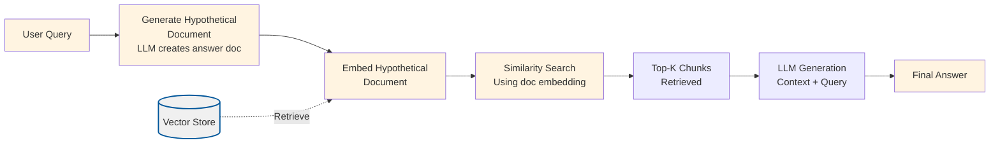

# HyDE (Hypothetical Document Embedding) RAG

## Overview

This project implements **HyDE (Hypothetical Document Embedding)**, a technique that improves retrieval quality by generating a synthetic document that answers the query, then using that document's embedding for retrieval instead of embedding the query directly.

HyDE addresses a fundamental problem in RAG systems: **the semantic gap between short queries and longer documents**. Queries are typically short, question-like strings, while documents are longer, detailed texts. When we embed them, they exist in different semantic spaces, making it harder to find good matches. HyDE bridges this gap by generating a hypothetical document that answers the query, moving the query embedding closer to the document embedding space.

## What Makes This Project Unique

**HyDE** introduces **runtime synthetic document generation** as a retrieval enhancement technique:

- **Hypothetical Document Generation**: Instead of embedding the user's query directly, HyDE uses an LLM to generate a detailed hypothetical document that answers the query. This document is similar in style and length to actual document chunks.

- **Embedding the Answer, Not the Question**: The key insight is that we embed the hypothetical document (which contains an answer) rather than the original query (which is a question). This improves alignment in the embedding space.

- **Runtime Generation**: Unlike techniques that pre-generate content during ingestion, HyDE generates the hypothetical document at query time, allowing it to adapt to each specific query.

### How Unique Concepts Work

#### Hypothetical Document Generation

**The Problem**: When we embed a query like "What is climate change?" and compare it to document chunks, there's a semantic mismatch. Queries are short and question-like; documents are long and detailed. Their embeddings exist in different regions of the embedding space.

**The Solution**: HyDE generates a hypothetical document that answers the query. For example:
- Query: "What is climate change?"
- Hypothetical Document: "Climate change refers to long-term shifts in global temperatures and weather patterns. It is primarily caused by human activities that increase greenhouse gas concentrations in the atmosphere, such as burning fossil fuels and deforestation. The effects include rising sea levels, more frequent extreme weather events, and changes in precipitation patterns..."

**How it works**:
1. Takes the user's query
2. Uses an LLM (configured via `hydeModel`) to generate a detailed hypothetical document answering the query
3. The generated document is approximately `targetDocumentLength` characters (defaults to `chunkSize`)
4. Embeds the hypothetical document (not the original query)
5. Uses the hypothetical document embedding to search the vector store
6. Retrieves chunks that are similar to the hypothetical answer

**Why this works**: By embedding a document-like answer instead of a question-like query, we move the search vector closer to the document embedding space. The hypothetical document is similar in:
- Length: Matches typical chunk sizes
- Style: Written like actual document content
- Detail: Contains comprehensive information (like real documents)

**Configuration**: Controlled by `hydeModel` (LLM for generation) and `targetDocumentLength` (target document size) in the config.

### How to Adjust for Different Use Cases

- **For better quality**: Use `gpt-4o` for `hydeModel` to generate more detailed and accurate hypothetical documents
- **For cost efficiency**: Use `gpt-4o-mini` for `hydeModel` (default)
- **For document length matching**: Set `targetDocumentLength` to match your `chunkSize` (default behavior)
- **For shorter documents**: Set `targetDocumentLength` smaller than `chunkSize` if your documents are typically shorter
- **For longer documents**: Set `targetDocumentLength` larger than `chunkSize` if you want more comprehensive hypothetical documents

## Process Diagrams

HyDE generates hypothetical documents at query time instead of using the query directly:

### Ingestion Process

The ingestion process follows the standard RAG pattern:


### Query Process with Hypothetical Document Generation



## Configuration

The project is configured via `config/hyde.config.json`:

```json
{
  "chunkSize": 800,
  "chunkOverlap": 200,
  "topK": 4,
  "embeddingModel": "text-embedding-3-small",
  "chatModel": "gpt-4o-mini",
  "dataPath": "../../shared/assets/data",
  "indexPath": ".tmp/index/hyde.index.json",
  "hydeModel": "gpt-4o-mini",
  "targetDocumentLength": 800
}
```

### Configuration Parameters Explained

**Standard RAG Parameters** (same as basic-rag):
- `chunkSize`: Characters per chunk (default: 800)
- `chunkOverlap`: Overlap between chunks (default: 200)
- `topK`: Number of chunks to retrieve (default: 4)
- `embeddingModel`: OpenAI embedding model (default: "text-embedding-3-small")
- `chatModel`: LLM for answer generation (default: "gpt-4o-mini")
- `dataPath`: Path to documents directory (default: "../../shared/assets/data")
- `indexPath`: Path to vector index file (default: ".tmp/index/hyde.index.json")

**HyDE Specific Parameters**:
- `hydeModel`: LLM model for generating hypothetical documents (default: "gpt-4o-mini")
  - Use `gpt-4o-mini` for cost efficiency
  - Use `gpt-4o` for better quality hypothetical documents
- `targetDocumentLength`: Target length for hypothetical documents in characters (default: 800, matches `chunkSize`)
  - Should be similar to `chunkSize` for best results
  - Range: 400-1200 characters recommended

### Runtime Data Directory (`.tmp/`)

- Generated artifacts (vector indexes) are written to `.tmp/`
- The directory is committed (via `.gitkeep`) but contents are ignored
- Deleting `.tmp/` is safe; `pnpm run ingest` will recreate files

## Setup

1. **Install dependencies** (from repository root):
   ```bash
   pnpm install
   ```

2. **Set up environment variables**:
   Create a `.env` file at the repository root with:
   ```bash
   OPENAI_API_KEY=your-api-key-here
   ```

3. **Prepare sample data**:
   The project uses sample data from `shared/assets/data/` by default (configured via `dataPath`). You can modify `dataPath` to point to your own document directory.

## Usage

### Step 1: Ingest Documents

This script reads documents, chunks them, generates embeddings, and stores them in a vector index. The ingestion process is identical to basic-rag (no HyDE-specific processing during ingestion).

```bash
cd projects/hyde
pnpm run ingest
```

**What happens during ingestion:**
1. Loads configuration from `config/hyde.config.json`
2. Reads all `.txt` and `.md` files from the directory specified in `dataPath` (default: `shared/assets/data/`)
3. Splits documents into chunks with configurable size and overlap
4. Generates embeddings for each chunk
5. Stores chunks and embeddings in a vector store
6. Persists the vector store to `.tmp/index/hyde.index.json`

**Expected output:**
```
{"level":"info","message":"Loading config",...}
{"level":"info","message":"Reading documents",...}
{"level":"info","message":"Loaded documents","meta":{"count":1}}
{"level":"info","message":"Created chunks","meta":{"count":625}}
{"level":"info","message":"Persisted vector index",...}
```

### Step 2: Query with HyDE

This script loads the vector index and provides an interactive CLI for asking questions using HyDE.

```bash
cd projects/hyde
pnpm run query
```

**What happens during querying:**
1. Loads the vector index from the persisted file
2. Initializes embedding and chat clients
3. Enters an interactive loop:
   - Prompts for a question
   - **Generates hypothetical document** that answers the question
   - **Embeds the hypothetical document** (not the original query)
   - Searches the vector store using the hypothetical document embedding
   - Constructs a prompt with retrieved context
   - Generates answer using the LLM
   - Displays answer and a preview of the hypothetical document

**Example interaction:**
```
> What is climate change?
```

The system will:
1. Generate a hypothetical document: "Climate change refers to long-term shifts in global temperatures..."
2. Embed the hypothetical document
3. Retrieve chunks similar to the hypothetical document
4. Generate answer based on retrieved context
5. Display:
   - The answer
   - A preview of the hypothetical document (first 200 characters)
   - Retrieval scores

## Validation Scenario

To verify that ingestion and querying work correctly, use this validation scenario:

**Setup**: Ensure you have ingested documents (run `pnpm run ingest`).

**Test Query**: "What is Nike's revenue strategy?"

**Expected Behavior**:
1. The system should generate a hypothetical document answering the question (e.g., "Nike's revenue strategy involves...")
2. The hypothetical document should be approximately 800 characters (matching `targetDocumentLength`)
3. The system should retrieve relevant chunks from the Nike annual report
4. The answer should mention revenue-related strategies from the document
5. Similarity scores should be logged (typically 0.7-0.9 for relevant chunks)
6. The logs should show:
   - The generated hypothetical document length
   - Retrieval results using the hypothetical document embedding
   - Answer generation status

**Verification**: Check the logs for:
- Hypothetical document generation (length, content preview)
- Embedding generation for the hypothetical document
- Retrieval scores and chunk counts
- Answer generation status

## Expected Outcomes

After running ingestion:
- Vector index file created at `.tmp/index/hyde.index.json`
- Logs showing document count, chunk count, and embedding generation
- No errors in the ingestion process

After running queries:
- Hypothetical documents generated for each query
- Answers generated based on retrieved context
- Retrieval scores displayed for transparency
- Answers should be more relevant than basic-rag for some queries (especially vague or short queries)

**Key Difference from Basic RAG**: HyDE should perform better on queries that are:
- Short or vague (e.g., "What is X?")
- Question-like rather than statement-like
- Requiring background context

## Understanding the Code

### Key Components

1. **`src/hyde.ts`**: Core HyDE functionality
   - `generateHypotheticalDocument()`: Generates a synthetic document answering the query

2. **`src/query.ts`**: Query pipeline with HyDE
   - `answerQuestionWithHyDE()`: Main query function that generates hypothetical document and uses it for retrieval
   - Interactive CLI for querying

3. **`src/ingest.ts`**: Document ingestion (reuses basic-rag pipeline)
   - No HyDE-specific processing during ingestion
   - Standard chunking and embedding process

### Algorithm Overview

**HyDE Pipeline**:
1. **Input**: User query
2. **Generate**: Create hypothetical document answering the query (using LLM)
3. **Embed**: Convert hypothetical document to vector (not the original query)
4. **Retrieve**: Search vector store using hypothetical document embedding
5. **Generate**: Use retrieved context to generate final answer

**Key Insight**: By embedding a document-like answer instead of a question-like query, we improve semantic alignment in the embedding space, leading to better retrieval.

## Troubleshooting

**Problem**: Hypothetical documents are too short or too long
- **Solution**: Adjust `targetDocumentLength` in config to match your `chunkSize` or desired length.

**Problem**: HyDE doesn't improve results compared to basic-rag
- **Solution**: This is expected for some queries. HyDE works best for vague or short queries. For specific queries, basic-rag may perform similarly.

**Problem**: Hypothetical document generation is slow
- **Solution**: Use `gpt-4o-mini` for `hydeModel` instead of `gpt-4o`.

**Problem**: Generated hypothetical documents are inaccurate
- **Solution**: Use `gpt-4o` for `hydeModel` to get better quality, or increase `targetDocumentLength` for more detailed documents.

**Problem**: Index file not found
- **Solution**: Run `pnpm run ingest` first to create the vector index.

## Related Projects

- **`basic-rag`**: Baseline RAG without HyDE (compare results)
- **`query-transform`**: Uses query transformation instead of document generation
- **`hype`**: Pre-generates hypothetical questions during ingestion (offline approach)

