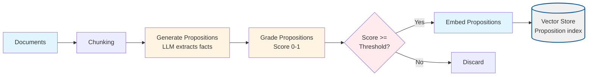
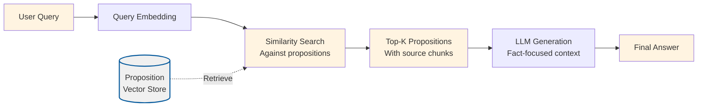

# Proposition Chunking

Proposition chunking converts raw text into short, verifiable statements so retrieval can match questions against discrete facts rather than long passages.

## What Makes This Project Unique

**Proposition Chunking** transforms the retrieval unit from raw text chunks to LLM-extracted factual propositions. Its uniqueness lies in:

- **Two-stage extraction**: First chunks documents normally, then uses an LLM to extract concise, standalone factual statements (propositions) from each chunk.
- **Quality grading**: Each proposition is graded by an LLM for how well it's grounded in the source chunk, filtering out hallucinations, incomplete statements, and inferred conclusions.
- **Proposition-level retrieval**: The vector index stores propositions (not raw chunks), so retrieval matches against focused facts rather than multi-sentence paragraphs.

### How the Unique Concepts Work

1. **Proposition generation**: For each document chunk, an LLM is prompted to extract up to `maxPropositions` concise, factual statements. This is controlled by `propositionModel` and `maxPropositions` in the config. The LLM is instructed to create self-contained, verifiable propositions.

2. **Proposition grading**: Each generated proposition is scored (0-1) by another LLM call based on:
   - **Accuracy**: Does it correctly represent information from the chunk?
   - **Completeness**: Does it contain enough information to be meaningful?
   - **Groundedness**: Is it directly supported by the chunk (not inferred)?
   This is controlled by `gradingModel` and `gradingThreshold` in the config.

3. **Filtered storage**: Only propositions with scores >= `gradingThreshold` are embedded and stored. Each proposition chunk includes metadata linking back to the source chunk for traceability.

4. **Proposition-based retrieval**: During querying, the system retrieves propositions (not raw chunks), providing more precise, fact-focused context to the LLM.

### How to Adjust for Different Use Cases

- **For higher proposition quality**: Use a stronger `propositionModel` (e.g., `gpt-4o`) and increase `gradingThreshold` (e.g., 0.7-0.8) to keep only the best propositions.

- **For better coverage**: Increase `maxPropositions` (e.g., 5-8) to extract more facts per chunk, but be aware this increases LLM costs.

- **For cost optimization**: Use lighter models for both generation and grading (e.g., `gpt-4o-mini`), or decrease `maxPropositions` to reduce the number of LLM calls.

- **For stricter filtering**: Increase `gradingThreshold` (e.g., 0.7-0.9) to keep only very high-quality propositions, improving precision but potentially reducing recall.

- **For better recall**: Decrease `gradingThreshold` (e.g., 0.4-0.5) to keep more propositions, or increase `topK` during querying to retrieve more propositions per query.

The end-to-end flow mirrors the reference notebook:

1. Chunk documents using the standard fixed-size algorithm.
2. Ask an LLM to propose concise factual statements for each chunk.
3. Grade every proposition for grounding.
4. Embed and store only the high-scoring propositions.
5. Query against proposition vectors and display the original chunk excerpt for context.

## Process Diagrams

Proposition Chunking transforms the retrieval unit from raw chunks to extracted propositions:

### Ingestion Process



### Query Process

Querying matches against proposition embeddings rather than raw chunks:



## Configuration

`config/proposition-chunking.config.json` introduces new fields:

| Field | Description |
| --- | --- |
| `propositionModel` | Model used to generate propositions. |
| `gradingModel` | Model used to score propositions (can match the generation model). |
| `maxPropositions` | Upper bound per chunk to control token usage. |
| `gradingThreshold` | Minimum score required for a proposition to be stored. |

Other core fields (`chunkSize`, `embeddingModel`, `indexPath`, etc.) behave just like the baseline project.

### Runtime Data Directory (`.tmp/`)

- Generated artifacts (vector indexes) are written to the project-local `.tmp/` directory
- The directory is committed (via `.gitkeep`) so contributors know where runtime files belong, but contents are ignored via `.gitignore`
- Deleting `.tmp/` is safe; `pnpm run ingest` will recreate the files
- The vector index stores proposition chunks with links back to source chunks

## Usage

```bash
pnpm install
export OPENAI_API_KEY=sk-your-key

cd projects/proposition-chunking
pnpm run ingest   # generates propositions and builds the index
pnpm run query    # answers questions using proposition-level retrieval
```

During ingestion, logs summarize how many propositions were generated and how many survived grading. Querying prints each proposition plus the original chunk excerpt so you can audit answers quickly.

### Quick validation (sanity check)

With the default `shared/assets/data/product_strategy.txt`, you can validate the pipeline with:

```bash
> What must the model do when it cannot find a grounded answer?
```

You should see at least one retrieved proposition stating that the model **must say it does not know**, **log the query**, and **trigger an annotation task**. The answer should echo these obligations in natural language.

If you ask something unrelated to the charter (for example, “What fabrics are used in winter jackets?”), the system should either surface no relevant propositions or respond that it doesn’t know based on the available context.

## Testing

```
pnpm --filter proposition-chunking test
```

Tests mock the LLM to verify proposition parsing, grading, and retrieval formatting without calling external APIs.

## Understanding the Code

### Key Components

1. **`src/ingest.ts`**: Enhanced ingestion pipeline with proposition generation
   - Standard document reading and chunking
   - `generatePropositions()`: Uses LLM to extract concise factual statements from each chunk
   - `gradePropositions()`: Scores each proposition for accuracy, completeness, and groundedness
   - Filters propositions by grading threshold
   - Embeds only high-scoring propositions
   - Stores propositions with links back to source chunks

2. **`src/query.ts`**: Query pipeline with proposition-based retrieval
   - Loads proposition-enhanced vector index
   - Retrieves propositions (not raw chunks) based on semantic similarity
   - Formats retrieved propositions with source chunk context for the LLM
   - Generates answers using fact-focused context

3. **Shared Utilities** (in `shared/typescript/utils/`):
   - `vectorStore.ts`: Vector storage and similarity search
   - `llm.ts`: OpenAI client wrappers for embeddings and chat
   - `config.ts`: Configuration loading and validation
   - `types.ts`: TypeScript type definitions

### Algorithm Overview

**Proposition Extraction Pipeline**:
1. **Chunk**: Split documents using standard fixed-size chunking
2. **Generate**: For each chunk, use LLM to extract up to `maxPropositions` concise factual statements
   - Propositions should be self-contained and verifiable
   - Each proposition is a standalone fact that can be checked
3. **Grade**: Score each proposition (0-1) based on:
   - **Accuracy**: Correctly represents chunk information
   - **Completeness**: Contains enough information to be meaningful
   - **Groundedness**: Directly supported by chunk (not inferred)
4. **Filter**: Keep only propositions with score >= `gradingThreshold`
5. **Embed**: Generate embeddings for validated propositions
6. **Store**: Save propositions with metadata linking to source chunks

**Proposition Query Pipeline**:
1. **Query**: User asks a question
2. **Embed**: Convert query to vector
3. **Retrieve**: Find top-K most similar proposition embeddings
4. **Format**: Include both propositions and source chunk excerpts in context
5. **Generate**: LLM generates answer using fact-focused propositions

**Key Insight**: By retrieving focused facts (propositions) instead of paragraphs, the system provides more precise context and reduces noise, leading to more accurate answers.

## Troubleshooting

| Symptom | Fix |
| --- | --- |
| “No propositions passed grading” | Lower `gradingThreshold` or increase `maxPropositions`. |
| CLI answers “I don't know” frequently | Increase `topK` or ensure documents contain propositions relevant to your questions. |
| Rate limits during ingestion | Decrease `maxPropositions` and chunk size, or run with batching/lower model. |

## Ideas

- Persist raw proposition + grade pairs for curriculum learning.
- Swap the grading model for a deterministic heuristic when budgets are tight.
- Combine with Reliable RAG validation to double-check proposition usage during inference.
