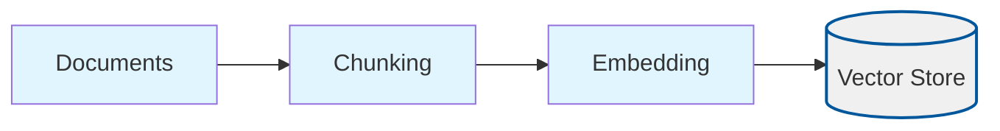
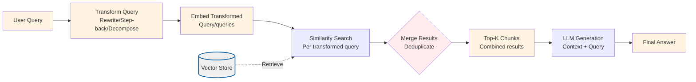

# Query Transform RAG

## Overview

This project implements **Query Transform RAG**, a technique that improves retrieval quality by transforming user queries before searching the vector index. Instead of using the original query directly, the system applies one or more transformation strategies to reformulate the query, making it more likely to match relevant documents.

Query Transform RAG addresses a fundamental problem in RAG systems: **the semantic gap between how users ask questions and how information is stored in documents**. Users often ask vague, ambiguous, or overly specific questions that don't align well with document content. By transforming queries, we can bridge this gap.

## What Makes This Project Unique

**Query Transform RAG** introduces three distinct query transformation strategies that can be used independently or in combination:

1. **Query Rewriting**: Reformulates vague queries into more specific, detailed queries that are more likely to match document content
2. **Step-back Prompting**: Generates broader, more general queries to retrieve background context and related information
3. **Sub-query Decomposition**: Breaks complex, multi-faceted queries into simpler sub-queries that can be answered separately and then combined

### How Unique Concepts Work

#### Query Rewriting

**The Problem**: Users often ask vague questions like "What is climate change?" which may not match specific document sections that discuss "causes of climate change" or "effects of climate change."

**The Solution**: Query rewriting uses an LLM to expand the query with more detail and specificity. For example:
- Original: "What is climate change?"
- Rewritten: "What are the specific causes, effects, and scientific evidence of climate change?"

**How it works**:
1. Takes the original user query
2. Uses an LLM (configured via `transformationModel`) to reformulate it with more detail
3. Uses the rewritten query for vector search instead of the original

**Configuration**: Controlled by `transformationType: "rewrite"` and `transformationModel` in the config.

#### Step-back Prompting

**The Problem**: Very specific queries like "What is the revenue for Q3 2023?" might miss relevant background information about financial trends or quarterly patterns.

**The Solution**: Step-back prompting generates a broader, more general query that provides context. For example:
- Original: "What is the revenue for Q3 2023?"
- Step-back: "What are the financial performance trends and quarterly revenue patterns?"

**How it works**:
1. Takes the specific user query
2. Uses an LLM to generate a more general "step-back" question
3. Uses the step-back query for retrieval to get broader context

**Configuration**: Controlled by `transformationType: "stepback"` and `transformationModel` in the config.

#### Sub-query Decomposition

**The Problem**: Complex queries covering multiple topics (e.g., "What are the impacts of climate change on the environment?") may not retrieve comprehensive information because they're too broad.

**The Solution**: Decomposition breaks the query into simpler sub-queries that can be answered separately:
- Original: "What are the impacts of climate change on the environment?"
- Sub-queries:
  1. "What are the impacts of climate change on biodiversity?"
  2. "How does climate change affect the oceans?"
  3. "What are the effects of climate change on agriculture?"
  4. "What are the impacts of climate change on human health?"

**How it works**:
1. Takes the complex query
2. Uses an LLM to decompose it into 2-4 simpler sub-queries (controlled by `maxSubQueries`)
3. Retrieves chunks for each sub-query independently
4. Merges and deduplicates the results
5. Uses the combined context to generate a comprehensive answer

**Configuration**: Controlled by `transformationType: "decompose"`, `transformationModel`, and `maxSubQueries` in the config.

#### Using All Transformations

When `transformationType: "all"`, the system:
1. Applies rewrite transformation and retrieves chunks
2. Applies step-back transformation and retrieves chunks
3. Applies decomposition and retrieves chunks for each sub-query
4. Merges all retrieved chunks (deduplicating by chunk ID)
5. Sorts by similarity score and takes top-K
6. Generates answer using the merged context

This provides the most comprehensive retrieval but is more expensive (multiple LLM calls and retrievals).

### How to Adjust for Different Use Cases

- **For vague queries**: Use `transformationType: "rewrite"` to add specificity
- **For overly specific queries**: Use `transformationType: "stepback"` to get broader context
- **For complex multi-topic queries**: Use `transformationType: "decompose"` with `maxSubQueries: 4-6`
- **For maximum coverage**: Use `transformationType: "all"` (but expect higher latency and cost)
- **For cost optimization**: Use a smaller model like `gpt-4o-mini` for `transformationModel`
- **For quality optimization**: Use `gpt-4o` for `transformationModel` to get better transformations

## Process Diagrams

Query Transform applies transformations to queries before retrieval:

### Ingestion Process

The ingestion process follows the standard RAG pattern:



### Query Process with Transformations



## Configuration

The project is configured via `config/query-transform.config.json`:

```json
{
  "chunkSize": 800,
  "chunkOverlap": 200,
  "topK": 4,
  "embeddingModel": "text-embedding-3-small",
  "chatModel": "gpt-4o-mini",
  "dataPath": "../../shared/assets/data",
  "indexPath": ".tmp/index/query-transform.index.json",
  "transformationType": "all",
  "transformationModel": "gpt-4o-mini",
  "maxSubQueries": 4
}
```

### Configuration Parameters Explained

**Standard RAG Parameters** (same as basic-rag):
- `chunkSize`: Characters per chunk (default: 800)
- `chunkOverlap`: Overlap between chunks (default: 200)
- `topK`: Number of chunks to retrieve (default: 4)
- `embeddingModel`: OpenAI embedding model (default: "text-embedding-3-small")
- `chatModel`: LLM for answer generation (default: "gpt-4o-mini")
- `dataPath`: Path to documents directory (default: "../../shared/assets/data")
- `indexPath`: Path to vector index file (default: ".tmp/index/query-transform.index.json")

**Query Transform Specific Parameters**:
- `transformationType`: Which transformation(s) to apply
  - `"rewrite"`: Only query rewriting
  - `"stepback"`: Only step-back prompting
  - `"decompose"`: Only sub-query decomposition
  - `"all"`: Apply all transformations and merge results
- `transformationModel`: LLM model for query transformations (default: "gpt-4o-mini")
  - Use `gpt-4o-mini` for cost efficiency
  - Use `gpt-4o` for better transformation quality
- `maxSubQueries`: Maximum number of sub-queries for decomposition (default: 4)
  - Range: 2-6 recommended
  - More sub-queries = more comprehensive but slower and more expensive

### Runtime Data Directory (`.tmp/`)

- Generated artifacts (vector indexes) are written to `.tmp/`
- The directory is committed (via `.gitkeep`) but contents are ignored
- Deleting `.tmp/` is safe; `pnpm run ingest` will recreate files

## Setup

1. **Install dependencies** (from repository root):
   ```bash
   pnpm install
   ```

2. **Set up environment variables**:
   Create a `.env` file at the repository root with:
   ```bash
   OPENAI_API_KEY=your-api-key-here
   ```

3. **Prepare sample data**:
   The project uses sample data from `shared/assets/data/` by default (configured via `dataPath`). You can modify `dataPath` to point to your own document directory.

## Usage

### Step 1: Ingest Documents

This script reads documents, chunks them, generates embeddings, and stores them in a vector index. The ingestion process is identical to basic-rag (no transformations are applied during ingestion).

```bash
cd projects/query-transform
pnpm run ingest
```

**What happens during ingestion:**
1. Loads configuration from `config/query-transform.config.json`
2. Reads all `.txt` and `.md` files from the directory specified in `dataPath` (default: `shared/assets/data/`)
3. Splits documents into chunks with configurable size and overlap
4. Generates embeddings for each chunk
5. Stores chunks and embeddings in a vector store
6. Persists the vector store to `.tmp/index/query-transform.index.json`

**Expected output:**
```
{"level":"info","message":"Loading config",...}
{"level":"info","message":"Reading documents",...}
{"level":"info","message":"Loaded documents","meta":{"count":1}}
{"level":"info","message":"Created chunks","meta":{"count":625}}
{"level":"info","message":"Persisted vector index",...}
```

### Step 2: Query with Transformations

This script loads the vector index and provides an interactive CLI for asking questions with query transformations.

```bash
cd projects/query-transform
pnpm run query
```

**What happens during querying:**
1. Loads the vector index from the persisted file
2. Initializes embedding and chat clients
3. **Prompts for transformation type** (with default from configuration)
4. Enters an interactive loop:
   - Prompts for a question (or command)
   - **Commands**:
     - `tt` - Change transformation type
     - `exit` - Quit the CLI
   - Applies selected transformation(s) to the query
   - Embeds the transformed query(ies)
   - Searches the vector store for top-K chunks
   - If decomposition: merges results from all sub-queries
   - Constructs a prompt with retrieved context
   - Generates answer using the LLM
   - Displays answer, transformed query, and sub-queries (if applicable)

**Example interaction:**
```
Available transformation types:
  1. rewrite - Query rewriting (makes queries more specific)
  2. stepback - Step-back prompting (generates broader queries)
  3. decompose - Sub-query decomposition (breaks complex queries into simpler ones)
  4. all - All transformations (combines all strategies)

Select transformation type [all]: 1

Current transformation type: rewrite
Type 'tt' to change transformation type, 'exit' to quit.

> What is Nike's strategy?
```

The system will:
1. Transform: "What is Nike's strategy?" → "What are Nike's specific business strategies, competitive advantages, and strategic initiatives?"
2. Retrieve chunks using the rewritten query
3. Generate answer based on retrieved context
4. Display:
   - The answer
   - The transformed query
   - Retrieval scores

**Changing transformation type at runtime:**
```
> tt

Available transformation types:
  1. rewrite - Query rewriting (makes queries more specific)
  2. stepback - Step-back prompting (generates broader queries)
  3. decompose - Sub-query decomposition (breaks complex queries into simpler ones)
  4. all - All transformations (combines all strategies)

Select transformation type [rewrite]: 3

Transformation type set to: decompose

> What are the impacts of climate change?
```

**Example interaction with decomposition:**
```
> What are the impacts of climate change?
```

The system will:
1. Decompose into sub-queries:
   - "What are the impacts of climate change on biodiversity?"
   - "How does climate change affect the oceans?"
   - "What are the effects of climate change on agriculture?"
   - "What are the impacts of climate change on human health?"
2. Retrieve chunks for each sub-query
3. Merge and deduplicate results
4. Generate comprehensive answer
5. Display:
   - The answer
   - All sub-queries
   - Retrieval scores

## Validation Scenario

To verify that ingestion and querying work correctly, use this validation scenario:

**Setup**: Ensure you have ingested documents (run `pnpm run ingest`).

**Test Query**: "What is Nike's revenue strategy?"

**Expected Behavior**:
1. If `transformationType: "rewrite"`: The query should be transformed to something like "What are Nike's specific revenue strategies, financial performance approaches, and revenue generation methods?"
2. The system should retrieve relevant chunks from the Nike annual report
3. The answer should mention revenue-related strategies from the document
4. Similarity scores should be logged (typically 0.7-0.9 for relevant chunks)

**Test Query**: "What are the main topics in the document?"

**Expected Behavior** (with `transformationType: "decompose"`):
1. The query should be decomposed into 2-4 sub-queries covering different aspects
2. Each sub-query should retrieve relevant chunks
3. The final answer should synthesize information from multiple sub-queries
4. The system should display all sub-queries used

**Verification**: Check the logs for:
- Transformation details (original → transformed)
- Sub-queries (if decomposition used)
- Retrieval scores and chunk counts
- Answer generation status

## Expected Outcomes

After running ingestion:
- Vector index file created at `.tmp/index/query-transform.index.json`
- Logs showing document count, chunk count, and embedding generation
- No errors in the ingestion process

After running queries:
- Answers generated based on retrieved context
- Transformation metadata logged (transformed queries, sub-queries)
- Retrieval scores displayed for transparency
- Answers should be more relevant when transformations are applied (compared to basic-rag)

## Understanding the Code

### Key Components

1. **`src/queryTransform.ts`**: Core transformation functions
   - `rewriteQuery()`: Reformulates queries for specificity
   - `generateStepBackQuery()`: Generates broader queries
   - `decomposeQuery()`: Breaks complex queries into sub-queries

2. **`src/query.ts`**: Query pipeline with transformations
   - `answerQuestionWithTransform()`: Main query function that applies transformations
   - `mergeRetrievedChunks()`: Merges results from multiple queries
   - Interactive CLI for querying

3. **`src/ingest.ts`**: Document ingestion (reuses basic-rag pipeline)
   - No transformations applied during ingestion
   - Standard chunking and embedding process

### Algorithm Overview

**Query Transformation Pipeline**:
1. **Input**: User query + transformation type
2. **Transform**: Apply selected transformation(s) using LLM
3. **Retrieve**: For each transformed query, embed and search vector store
4. **Merge**: If multiple queries, deduplicate and sort by score
5. **Generate**: Use merged context to generate answer

**Transformation Selection**:
- Single transformation: Apply one strategy (rewrite, stepback, or decompose)
- All transformations: Apply all strategies, merge all results

## Troubleshooting

**Problem**: Transformations don't seem to improve results
- **Solution**: Try different `transformationType` values. Some queries work better with rewrite, others with step-back or decomposition.

**Problem**: Decomposition produces too many/few sub-queries
- **Solution**: Adjust `maxSubQueries` in config (2-6 recommended).

**Problem**: Transformations are slow
- **Solution**: Use `gpt-4o-mini` for `transformationModel` instead of `gpt-4o`.

**Problem**: No chunks retrieved after transformation
- **Solution**: Check if the transformed query is too different from document content. Try a different transformation type.

**Problem**: Index file not found
- **Solution**: Run `pnpm run ingest` first to create the vector index.

## Related Projects

- **`basic-rag`**: Baseline RAG without transformations (compare results)
- **`hyde`**: Uses hypothetical document generation instead of query transformation
- **`hype`**: Pre-generates hypothetical questions during ingestion

