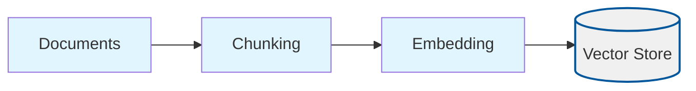
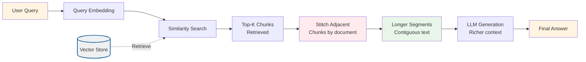

# Relevant Segments (Relevant Segment Extraction)

## Overview

This project implements **Relevant Segment Extraction**, a technique that improves answer quality by stitching adjacent retrieved chunks from the same document into longer, contiguous segments. Instead of passing fragmented chunks to the LLM, the system merges neighboring chunks to provide richer, more coherent context windows.

Relevant Segments addresses a fundamental problem in RAG systems: **retrieved chunks are often fragmented**. When we retrieve top-K chunks, they may be:
- Split across multiple small pieces that don't form complete thoughts
- Missing important context that spans chunk boundaries
- Difficult for the LLM to understand when read in isolation

By stitching adjacent chunks from the same document into longer segments, we:
- Provide more coherent context to the LLM
- Preserve narrative flow and complete thoughts
- Reduce fragmentation that can confuse answer generation
- Maintain document structure and continuity

## What Makes This Project Unique

**Relevant Segments** introduces **post-retrieval stitching** as a context enrichment technique:

- **Adjacent Chunk Merging**: Automatically identifies and merges chunks that are adjacent (consecutive indices) from the same document
- **Contiguous Segments**: Creates longer, contiguous text segments that preserve narrative flow
- **Size Control**: Respects a maximum segment size (`segmentMaxChars`) to avoid oversized prompts
- **Score Preservation**: Keeps the highest similarity score from the merged chunks

### How the Unique Concepts Work

1. **Stitching Algorithm**: After retrieving top-K chunks, the system:
   - Groups chunks by `documentId` (chunks from the same document)
   - Sorts chunks by `index` within each document group
   - Merges consecutive chunks (where `chunk.index + 1 === nextChunk.index`) from the same document
   - Stops merging when the combined segment would exceed `segmentMaxChars`
   - Creates new segments when chunks are not adjacent or from different documents

2. **Segment Construction**: When chunks are merged:
   - Content is combined with `\n\n` (double newline) separator
   - The highest similarity score from merged chunks is preserved
   - Metadata is preserved from the first chunk
   - The segment represents a longer, more coherent piece of text

3. **Size Control**: The `segmentMaxChars` parameter (default: 800) ensures:
   - Segments don't exceed prompt limits
   - Balance between context richness and token efficiency
   - Prevents overly long segments that might include irrelevant information

### How to Adjust for Different Use Cases

- **For richer context**: Increase `segmentMaxChars` (e.g., 1200-1600) to allow longer stitched segments
- **For tighter prompts**: Decrease `segmentMaxChars` (e.g., 600-700) to keep segments shorter
- **For better stitching**: Increase `topK` to retrieve more chunks, giving the stitching algorithm more adjacent chunks to work with
- **For chunk size tuning**: Adjust `chunkSize` and `chunkOverlap` - more overlap means more adjacent chunks can be stitched together

## Process Diagrams

Relevant Segments adds a stitching step after retrieval:

### Ingestion Process

The ingestion process follows the standard RAG pattern:



### Query Process with Stitching



## Configuration

The project is configured via `config/relevant-segments.config.json`:

```json
{
  "chunkSize": 800,
  "chunkOverlap": 200,
  "topK": 4,
  "embeddingModel": "text-embedding-3-small",
  "chatModel": "gpt-4o-mini",
  "dataPath": "../../shared/assets/data",
  "indexPath": ".tmp/index/relevant-segments.index.json",
  "segmentMaxChars": 800
}
```

### Configuration Parameters Explained

**Standard RAG Parameters** (same as basic-rag):
- `chunkSize`: Characters per chunk (default: 800)
- `chunkOverlap`: Overlap between chunks (default: 200)
- `topK`: Number of chunks to retrieve before stitching (default: 4)
  - More chunks = more opportunities for stitching adjacent chunks
- `embeddingModel`: OpenAI embedding model (default: "text-embedding-3-small")
- `chatModel`: LLM for answer generation (default: "gpt-4o-mini")
- `dataPath`: Path to documents directory (default: "../../shared/assets/data")
- `indexPath`: Path to vector index file (default: ".tmp/index/relevant-segments.index.json")

**Relevant Segments Specific Parameters**:
- `segmentMaxChars`: Maximum characters per stitched segment (default: 800)
  - Controls how long merged segments can be
  - Should be similar to or slightly larger than `chunkSize`
  - Range: 600-1600 characters recommended
  - Larger values = richer context but more tokens
  - Smaller values = tighter prompts but potentially less context

### Runtime Data Directory (`.tmp/`)

- Generated artifacts (vector indexes) are written to the project-local `.tmp/` directory
- The directory is committed (via `.gitkeep`) so contributors know where runtime files belong, but contents are ignored via `.gitignore`
- Deleting `.tmp/` is safe; `pnpm run ingest` will recreate the files

## Setup

1. **Install dependencies** (from repository root):
   ```bash
   pnpm install
   ```

2. **Set up environment variables**:
   Create a `.env` file at the repository root with:
   ```bash
   OPENAI_API_KEY=your-api-key-here
   ```

3. **Prepare sample data**:
   The project uses sample data from `shared/assets/data/` by default (configured via `dataPath`). You can modify `dataPath` to point to your own document directory.

## Usage

### Step 1: Ingest Documents

This script reads documents, chunks them, generates embeddings, and stores them in a vector index. The ingestion process is identical to basic-rag (no stitching during ingestion).

```bash
cd projects/relevant-segments
pnpm run ingest
```

**What happens during ingestion:**
1. Loads configuration from `config/relevant-segments.config.json`
2. Reads all `.txt` and `.md` files from the directory specified in `dataPath` (default: `shared/assets/data/`)
3. Splits documents into chunks with configurable size and overlap
4. Generates embeddings for each chunk using the specified embedding model
5. Stores chunks and embeddings in a vector store
6. Persists the vector store to `.tmp/index/relevant-segments.index.json`

**Expected output:**
```
{"level":"info","message":"Loading config",...}
{"level":"info","message":"Reading documents",...}
{"level":"info","message":"Loaded documents","meta":{"count":1}}
{"level":"info","message":"Created chunks","meta":{"count":625}}
{"level":"info","message":"Persisted vector index",...}
```

### Step 2: Query with Segment Stitching

This script loads the vector index and provides an interactive CLI for asking questions with segment stitching.

```bash
cd projects/relevant-segments
pnpm run query
```

**What happens during querying:**
1. Loads the vector index from the persisted file
2. Initializes embedding and chat clients
3. Enters an interactive loop:
   - Prompts for a question
   - Embeds the question into a vector
   - Searches the vector store for the top-K most similar chunks
   - **Stitches adjacent chunks** from the same document into longer segments
   - Constructs a prompt with the stitched segments (instead of individual chunks)
   - Sends the prompt to the LLM for answer generation
   - Displays the answer

**Example interaction:**
```
> What is Nike's revenue strategy?
```

The system will:
1. Retrieve the 4 most relevant chunks
2. Stitch adjacent chunks from the same document into longer segments
3. Generate an answer based on the stitched segments
4. Display the answer

**Key Difference**: The prompt contains longer, more coherent segments instead of fragmented chunks, providing better context to the LLM.

Type `exit` to quit the interactive session.

### Validation Scenario

To verify that ingestion and querying work correctly, use this validation scenario:

**Setup**: Ensure you have ingested documents (run `pnpm run ingest`).

**Test Query**: "What is Nike's revenue strategy?"

**Expected Behavior**:
1. The system should retrieve relevant chunks from the Nike annual report (default sample document)
2. Adjacent chunks from the same document should be stitched together into longer segments
3. The logs should show:
   - Query embedding generation
   - Retrieval results (number of chunks retrieved)
   - Stitching results (number of segments after stitching, should be <= number of chunks)
   - Answer generation status
4. The answer should mention revenue-related strategies from the document
5. Stitched segments should be longer and more coherent than individual chunks

**Verification**: Check the logs for:
- Retrieval scores and chunk counts
- Stitching results (segments created, segment lengths)
- Answer generation status
- The answer should be grounded in the retrieved document content
- Compare segment lengths: stitched segments should be longer than individual chunks

## Expected Outcomes

### After Ingestion

- A vector index file is created at `.tmp/index/relevant-segments.index.json`
- The file contains all document chunks with their embeddings
- No stitching is applied during ingestion (stitching happens at query time)

### During Querying

- **Stitched Segments**: Retrieved chunks are merged into longer segments when they're adjacent
- **Richer Context**: Segments provide more coherent context than fragmented chunks
- **Better Answers**: Answers should be more complete and better grounded due to richer context
- **Fewer Segments**: The number of segments passed to the LLM is typically less than the number of retrieved chunks (due to merging)

### Example Queries and Expected Behavior

**Query**: "What is the main topic of the document?"
- **Expected**: Retrieves chunks containing overview content, stitches adjacent chunks into longer segments
- **Answer**: Should summarize the document's main themes with better coherence due to stitched context

**Query**: "What are the key financial metrics?"
- **Expected**: Retrieves chunks with financial data, stitches adjacent chunks to preserve complete metric descriptions
- **Answer**: Should list specific metrics with better context preservation

**Query**: "What is the weather today?"
- **Expected**: Retrieves chunks (if any) but they won't be relevant
- **Answer**: Should indicate that the information is not available in the provided context

**Key Benefit**: Compared to basic-rag, answers should be more coherent and complete due to richer, less fragmented context.

## Understanding the Code

### Key Components

1. **`src/ingest.ts`**: Document ingestion pipeline
   - Standard ingestion process (no stitching during ingestion)
   - Reuses basic-rag ingestion logic
   - Creates vector index for retrieval

2. **`src/query.ts`**: Query pipeline with stitching
   - `answerQuestion()`: Main query function that applies stitching
   - Uses `stitchRetrievedChunks()` from shared utilities to merge adjacent chunks
   - Builds prompt with stitched segments instead of individual chunks
   - Generates answer using richer context

3. **Shared Utilities** (in `shared/typescript/utils/`):
   - `evaluation.ts`: Contains `stitchRetrievedChunks()` function
     - Groups chunks by document
     - Merges consecutive chunks from the same document
     - Respects `segmentMaxChars` limit
   - `vectorStore.ts`: Vector storage and similarity search
   - `llm.ts`: OpenAI client wrappers for embeddings and chat
   - `config.ts`: Configuration loading and validation
   - `types.ts`: TypeScript type definitions

### How It Works: The Stitching Pipeline

```
Query → Embedding → Similarity Search → Top-K Chunks → Stitch Adjacent → Longer Segments → LLM Generation → Answer
```

1. **Retrieval**: Standard semantic similarity search retrieves top-K chunks
2. **Grouping**: Chunks are grouped by `documentId` and sorted by `index`
3. **Stitching**: Consecutive chunks (adjacent indices) from the same document are merged:
   - Content is combined with `\n\n` separator
   - Highest similarity score is preserved
   - Merging stops when segment would exceed `segmentMaxChars`
4. **Answer Generation**: LLM generates answer using stitched segments (richer context)

**Key Insight**: By merging adjacent chunks from the same document, we preserve narrative flow and provide more coherent context to the LLM, leading to better answers.

## Troubleshooting

### "OPENAI_API_KEY is not set"
- Ensure you have a `.env` file at the repository root with your API key
- The `loadEnv()` function should automatically find and load it

### "Config file not found"
- Ensure `config/relevant-segments.config.json` exists in the project directory
- Or set `RAG_CONFIG_PATH` environment variable to point to your config

### "Vector index file not found"
- Run `pnpm run ingest` first to create the index
- Check that `indexPath` in config points to the correct location

### No chunks are being stitched
- Ensure retrieved chunks are from the same document and have consecutive indices
- Increase `topK` to retrieve more chunks, increasing chances of adjacent chunks
- Check that `chunkOverlap` is sufficient to create adjacent chunks during ingestion

### Segments are too long
- Decrease `segmentMaxChars` to limit segment size
- Or decrease `topK` to retrieve fewer chunks

### Segments are too short (not enough stitching)
- Increase `segmentMaxChars` to allow longer merged segments
- Increase `topK` to retrieve more chunks (more opportunities for stitching)
- Increase `chunkOverlap` during ingestion to create more adjacent chunks

### Poor retrieval quality
- Try adjusting `chunkSize` and `chunkOverlap` in the config
- Increase `topK` to retrieve more chunks
- Consider using a larger embedding model

### Answers not grounded in context
- Check the similarity scores of retrieved chunks (lower scores = less relevant)
- Verify your documents contain information relevant to the query
- The LLM prompt instructs it to say "I don't know" if context is insufficient
- Stitching should help by providing richer context

## Related Projects

- **`basic-rag`**: Baseline RAG without stitching (compare results)
- **`context-window`**: Expands context around retrieved chunks (different approach to context enrichment)
- **`contextual-compression`**: Compresses retrieved context (can be combined with stitching)

## Next Steps

After understanding relevant segments, explore other context enrichment techniques:
- **`context-window`**: Expands context around retrieved chunks
- **`contextual-compression`**: Compresses retrieved context before answering
- **`chunk-headers`**: Adds contextual headers to chunks before embedding

Each technique addresses different aspects of improving retrieval and answer quality.
