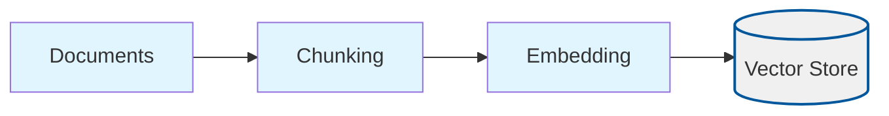
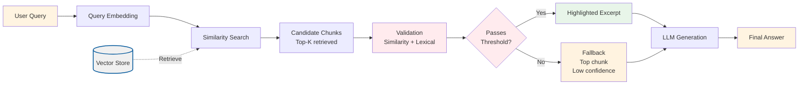

# Reliable RAG

Reliable RAG demonstrates how to harden retrieval before handing context to an LLM. It mirrors the “Reliable RAG” notebook by:

1. Building the standard text-document index during ingestion.
2. Retrieving candidate chunks for each query.
3. Validating those chunks with two signals: vector similarity and lexical overlap with the user’s question.
4. Highlighting the matching excerpt so reviewers can quickly inspect evidence.
5. Falling back gracefully when no chunk clears the threshold.

## What Makes This Project Unique

**Reliable RAG** adds a validation layer between retrieval and generation. Its uniqueness lies in:

- **Dual-criteria validation**: Uses both embedding similarity (semantic) and lexical overlap (keyword matching) to validate retrieved chunks, catching false positives that pure semantic search might miss.
- **Transparent validation**: Shows validation scores, overlap metrics, and highlighted excerpts so users can see why chunks were accepted or rejected.
- **Graceful degradation**: If no chunks pass validation, falls back to the top-scoring chunk (marked as low-confidence) rather than returning empty context, ensuring the LLM always has something to work with.

### How the Unique Concepts Work

1. **Dual-criteria validation**: Each retrieved chunk is evaluated on two dimensions:
   - **Embedding similarity**: The cosine similarity score from vector search (must be >= `relevanceThreshold`, default 0.35).
   - **Lexical overlap**: The percentage of question keywords that appear in the chunk (must be >= 0.4, or 40%).
   A chunk is considered "validated" if it passes **either** criterion. This is controlled by `relevanceThreshold` in the config and the hardcoded 0.4 overlap threshold in `validateRetrievedChunks()`.

2. **Keyword tokenization**: Questions are tokenized into meaningful keywords (words >= 4 characters, filtered to remove stop words) for lexical matching. This is done by `tokenizeQuestion()`.

3. **Excerpt highlighting**: For validated chunks, the system extracts a window of text around the first matching keyword (controlled by `highlightWindow`) to show why the chunk is relevant. This is done by `extractExcerpt()`.

4. **Fallback behavior**: If no chunks pass validation, the system includes the top-scoring chunk anyway (marked as "low-confidence") to ensure the LLM has context, even if it's uncertain.

### How to Adjust for Different Use Cases

- **For stricter validation**: Increase `relevanceThreshold` (e.g., 0.4-0.5) to require higher similarity scores, or modify the overlap threshold in code (currently 0.4) to require more keyword matches.

- **For more permissive validation**: Decrease `relevanceThreshold` (e.g., 0.25-0.3) to accept lower similarity scores, or lower the overlap threshold in code.

- **For better transparency**: Increase `highlightWindow` (e.g., 160-200) to show more context around matched keywords in the excerpt.

- **For better recall**: Increase `topK` (e.g., 6-8) to retrieve more candidate chunks, giving validation more options to choose from.

- **For better precision**: Decrease `topK` (e.g., 3-4) to focus on only the most similar chunks, reducing noise in validation.

## Process Diagrams

Reliable RAG adds a validation layer to the query process:

### Ingestion Process

The ingestion process follows the standard RAG pattern:



### Query Process with Validation



## Configuration (`config/reliable-rag.config.json`)

| Field | Description |
| --- | --- |
| `chunkSize`, `chunkOverlap`, `topK`, `embeddingModel`, `chatModel`, `dataPath`, `indexPath` | Same as the baseline project. |
| `relevanceThreshold` | Minimum cosine similarity required for a chunk to be considered validated. |
| `highlightWindow` | Number of characters to capture around the first matching keyword for display. Larger values show more context. |

Example:

```json
{
  "chunkSize": 800,
  "chunkOverlap": 200,
  "topK": 4,
  "embeddingModel": "text-embedding-3-small",
  "chatModel": "gpt-4o-mini",
  "dataPath": "../../shared/assets/data",
  "indexPath": ".tmp/index/reliable-rag.index.json",
  "relevanceThreshold": 0.35,
  "highlightWindow": 120
}
```

## Setup & Usage

```bash
pnpm install
export OPENAI_API_KEY=sk-your-key

cd projects/reliable-rag
pnpm run ingest   # builds the vector index from shared/assets/data/*.txt|md
pnpm run query    # launches the validation-aware CLI
```

During querying the CLI prints validated chunks, their overlap score, and the highlighted excerpt before generating an answer. If the validator rejects every chunk it instructs the LLM to return “I don’t know.”

### Quick validation (sanity check)

After running `pnpm run ingest` and `pnpm run query`, try:

```bash
> How did water usage change at the Portland campus?
```

Given the default `shared/assets/data/operations_update.txt`, you should see:

- A validated chunk mentioning an **18%** drop in water usage at the Portland campus
- An answer that clearly states something like:  
  “Water usage at the Portland campus decreased by 18% year over year through recycling and rainwater harvesting.”

If you ask something unrelated to the ingested document, for example:

```bash
> What is the stock price today?
```

The system should either return low-confidence chunks or explicitly answer that it doesn’t know based on the available context.

## Validation Logic

- **Cosine similarity gate**: chunks must meet `relevanceThreshold`.
- **Keyword overlap**: even if similarity is low, a chunk can pass if ≥40% of the significant query tokens appear inside it.
- **Highlighting**: the first matching keyword is wrapped by `highlightWindow` characters to provide immediate transparency.

These heuristics run locally, so you can mock them in tests without additional API calls.

## Understanding the Code

### Key Components

1. **`src/ingest.ts`**: Document ingestion pipeline
   - Reuses the basic RAG ingestion process (document reading, chunking, embedding)
   - No validation-specific processing during ingestion
   - Standard vector index creation

2. **`src/query.ts`**: Query pipeline with validation
   - `validateRetrievedChunks()`: Validates chunks using dual criteria (similarity + lexical overlap)
   - `tokenizeQuestion()`: Extracts meaningful keywords from questions for lexical matching
   - `extractExcerpt()`: Extracts highlighted text around matching keywords
   - `answerQuestion()`: Main query function that applies validation before generation
   - Interactive CLI for querying with validation feedback

3. **Shared Utilities** (in `shared/typescript/utils/`):
   - `vectorStore.ts`: Vector storage and similarity search
   - `llm.ts`: OpenAI client wrappers for embeddings and chat
   - `config.ts`: Configuration loading and validation
   - `types.ts`: TypeScript type definitions

### Algorithm Overview

**Validation Pipeline**:
1. **Retrieve**: Get top-K chunks using standard semantic similarity search
2. **Validate Each Chunk**: For each retrieved chunk, check:
   - **Similarity Threshold**: Does cosine similarity >= `relevanceThreshold`? (default 0.35)
   - **Lexical Overlap**: Do >= 40% of question keywords appear in the chunk?
   - A chunk passes if it meets **either** criterion
3. **Extract Excerpts**: For validated chunks, extract text window around first matching keyword
4. **Fallback**: If no chunks pass validation, include top-scoring chunk with low-confidence flag
5. **Generate**: Use validated chunks (or fallback) to generate answer

**Validation Logic**:
- **Keyword Tokenization**: Filters words >= 4 characters, removes stop words
- **Overlap Calculation**: Percentage of question keywords found in chunk
- **Threshold Check**: Chunk validated if similarity >= threshold OR overlap >= 0.4

**Key Insight**: Dual-criteria validation catches false positives that pure semantic search might miss, improving answer reliability and providing transparency into why chunks were selected.

## Testing

```bash
pnpm --filter reliable-rag test
```

Tests cover ingestion orchestration, validation heuristics, prompt construction, and fallback behavior when no chunk validates.

## Troubleshooting

| Symptom | Resolution |
| --- | --- |
| “Missing config key: relevanceThreshold” | Ensure your config file includes the new fields or set `RAG_CONFIG_PATH`. |
| CLI always says “I don’t know” | Lower `relevanceThreshold` or reduce question complexity so overlap improves. |
| Highlight text looks truncated | Increase `highlightWindow` for longer excerpts. |

## Extending

- Replace lexical overlap with a small local cross-encoder or reranker.
- Persist validation summaries for offline auditing.
- Combine with the CSV RAG project to validate structured answers.
