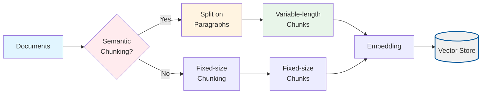
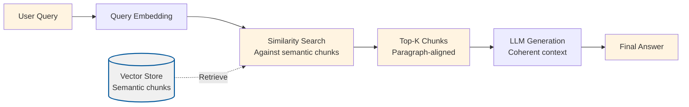

# Semantic Chunking

## Overview

This project implements **Semantic Chunking**, a technique that improves retrieval quality by using paragraph-based, semantically coherent chunks instead of fixed-size windows. Instead of splitting documents at arbitrary character boundaries, the system splits on paragraph boundaries (blank lines) to preserve meaning and sentence structure.

Semantic Chunking addresses a fundamental problem in RAG systems: **fixed-size chunking often breaks sentences and thoughts**. When we split documents at fixed character boundaries, we may:
- Split sentences in the middle, losing meaning
- Break apart related ideas that belong together
- Create chunks that don't make sense when read in isolation
- Lose paragraph-level context and structure

By using paragraph-based semantic chunking, we:
- Preserve sentence and paragraph structure
- Keep related ideas together
- Create chunks that are more coherent and meaningful
- Improve retrieval quality on narrative text

## What Makes This Project Unique

**Semantic Chunking** introduces **paragraph-based chunking** as an alternative to fixed-size windows:

- **Paragraph Boundaries**: Splits documents on blank lines (two or more consecutive newlines) instead of fixed character counts
- **Semantic Coherence**: Preserves sentence and paragraph structure, keeping related ideas together
- **Variable Length**: Chunks are variable-length based on paragraph size (unlike fixed-size chunking)
- **Fallback Handling**: For very long paragraphs, falls back to fixed-size splitting to stay within model limits

### How the Unique Concepts Work

1. **Paragraph Detection**: The system identifies paragraphs by:
   - Splitting on blank lines (two or more consecutive newlines: `/\n{2,}/g`)
   - Trimming whitespace from each paragraph
   - Filtering out empty paragraphs
   - Each paragraph becomes a potential chunk

2. **Chunk Creation**: For each paragraph:
   - If the paragraph fits within `chunkSize`, it becomes a single chunk
   - If the paragraph exceeds `chunkSize`, it's split using fixed-size windowing with overlap
   - This ensures chunks stay within embedding model limits while preserving structure when possible

3. **Overlap Handling**: When long paragraphs are split:
   - Uses the same `chunkOverlap` parameter as fixed-size chunking
   - Ensures important information spanning split boundaries is preserved
   - Maintains consistency with other chunking strategies

### How to Adjust for Different Use Cases

- **For narrative text**: Enable semantic chunking (`semanticChunking: true`) - works best for documents with clear paragraph structure
- **For structured text**: If your documents don't have clear paragraph breaks, disable semantic chunking (`semanticChunking: false`) to use fixed-size chunking
- **For paragraph size control**: Adjust `chunkSize` - paragraphs larger than this will be split using fixed-size windows
- **For better structure preservation**: Ensure your source documents have clear paragraph breaks (blank lines between paragraphs)

## Process Diagrams

Semantic Chunking uses paragraph-based splitting during ingestion:

### Ingestion Process with Semantic Chunking



### Query Process

The query process follows the standard RAG pattern:



## Configuration

The project is configured via `config/semantic-chunking.config.json`:

```json
{
  "chunkSize": 800,
  "chunkOverlap": 200,
  "topK": 4,
  "embeddingModel": "text-embedding-3-small",
  "chatModel": "gpt-4o-mini",
  "dataPath": "../../shared/assets/data",
  "indexPath": ".tmp/index/semantic-chunking.index.json",
  "semanticChunking": true
}
```

### Configuration Parameters Explained

**Standard RAG Parameters** (same as basic-rag):
- `chunkSize`: Maximum characters per chunk (default: 800)
  - For semantic chunking: paragraphs larger than this will be split using fixed-size windows
  - For fixed-size chunking: exact chunk size
- `chunkOverlap`: Overlap between chunks (default: 200)
  - Used when long paragraphs are split
  - Also used for fixed-size chunking when `semanticChunking: false`
- `topK`: Number of chunks to retrieve (default: 4)
- `embeddingModel`: OpenAI embedding model (default: "text-embedding-3-small")
- `chatModel`: LLM for answer generation (default: "gpt-4o-mini")
- `dataPath`: Path to documents directory (default: "../../shared/assets/data")
- `indexPath`: Path to vector index file (default: ".tmp/index/semantic-chunking.index.json")

**Semantic Chunking Specific Parameters**:
- `semanticChunking`: Boolean flag to enable/disable semantic chunking (default: true)
  - `true`: Use paragraph-based chunking (splits on blank lines)
  - `false`: Use fixed-size chunking (same as basic-rag)
  - Enable for narrative text with clear paragraph structure
  - Disable for structured text without paragraph breaks

### Runtime Data Directory (`.tmp/`)

- Generated artifacts (vector indexes) are written to the project-local `.tmp/` directory
- The directory is committed (via `.gitkeep`) so contributors know where runtime files belong, but contents are ignored via `.gitignore`
- Deleting `.tmp/` is safe; `pnpm run ingest` will recreate the files

## Setup

1. **Install dependencies** (from repository root):
   ```bash
   pnpm install
   ```

2. **Set up environment variables**:
   Create a `.env` file at the repository root with:
   ```bash
   OPENAI_API_KEY=your-api-key-here
   ```

3. **Prepare sample data**:
   The project uses sample data from `shared/assets/data/` by default (configured via `dataPath`). You can modify `dataPath` to point to your own document directory.
   
   **Note**: For best results with semantic chunking, ensure your documents have clear paragraph breaks (blank lines between paragraphs).

## Usage

### Step 1: Ingest Documents with Semantic Chunking

This script reads documents, chunks them using semantic (paragraph-based) chunking, generates embeddings, and stores them in a vector index.

```bash
cd projects/semantic-chunking
pnpm run ingest
```

**What happens during ingestion:**
1. Loads configuration from `config/semantic-chunking.config.json`
2. Reads all `.txt` and `.md` files from the directory specified in `dataPath` (default: `shared/assets/data/`)
3. **Chunks documents**:
   - If `semanticChunking: true`: Splits on paragraph boundaries (blank lines)
   - If `semanticChunking: false`: Uses fixed-size chunking (same as basic-rag)
   - Long paragraphs (> `chunkSize`) are split using fixed-size windows with overlap
4. Generates embeddings for each chunk using the specified embedding model
5. Stores chunks and embeddings in a vector store
6. Persists the vector store to `.tmp/index/semantic-chunking.index.json`

**Expected output:**
```
{"level":"info","message":"Loading config",...}
{"level":"info","message":"Reading documents",...}
{"level":"info","message":"Loaded documents","meta":{"count":1}}
{"level":"info","message":"Created chunks","meta":{"count":X,"strategy":"semantic"}}
{"level":"info","message":"Persisted vector index",...}
```

### Step 2: Query the RAG System

This script loads the vector index and provides an interactive CLI for asking questions.

```bash
cd projects/semantic-chunking
pnpm run query
```

**What happens during querying:**
1. Loads the vector index from the persisted file
2. Initializes embedding and chat clients
3. Enters an interactive loop:
   - Prompts for a question
   - Embeds the question into a vector
   - Searches the vector store for the top-K most similar chunks (paragraph-aligned chunks)
   - Constructs a prompt with the retrieved context
   - Sends the prompt to the LLM for answer generation
   - Displays the answer

**Example interaction:**
```
> What is Nike's revenue strategy?
```

The system will:
- Find the most relevant paragraph-aligned chunks from the ingested documents
- Show similarity scores for each chunk
- Generate an answer based on those chunks
- The retrieved chunks should be coherent paragraphs (no mid-sentence breaks)

Type `exit` to quit the interactive session.

### Validation Scenario

To verify that ingestion and querying work correctly, use this validation scenario:

**Setup**: Ensure you have ingested documents (run `pnpm run ingest`).

**Test Query**: "What is Nike's revenue strategy?"

**Expected Behavior**:
1. The system should retrieve relevant paragraph-aligned chunks from the Nike annual report (default sample document)
2. Retrieved chunks should be complete paragraphs (no mid-sentence truncation)
3. Similarity scores should be logged (typically 0.7-0.9 for relevant chunks)
4. The answer should mention revenue-related strategies from the document
5. The logs should show:
   - Query embedding generation
   - Retrieval results with scores
   - Answer generation status
   - Chunking strategy (should be "semantic" if enabled)

**Verification**: Check the logs for:
- Chunking strategy (semantic vs fixed-size)
- Retrieval scores and chunk counts
- Answer generation status
- The answer should be grounded in the retrieved document content
- Retrieved chunks should be coherent paragraphs (inspect chunk content in logs)

## Expected Outcomes

### After Ingestion

- A vector index file is created at `.tmp/index/semantic-chunking.index.json`
- The file contains paragraph-aligned chunks (if semantic chunking enabled) with their embeddings
- Chunks should be variable-length based on paragraph size (unlike fixed-size chunks)
- Chunks should preserve sentence and paragraph structure

### During Querying

- **Coherent Retrieval**: Retrieved chunks should be complete paragraphs (no mid-sentence breaks)
- **Better Context**: Paragraph-aligned chunks provide more coherent context to the LLM
- **Improved Answers**: Answers should be better grounded due to coherent chunk structure
- **Structure Preservation**: Retrieved chunks maintain paragraph-level structure

### Example Queries and Expected Behavior

**Query**: "What is the main topic of the document?"
- **Expected**: Retrieves paragraph-aligned chunks containing overview content
- **Answer**: Should summarize the document's main themes with better coherence

**Query**: "What are the key financial metrics?"
- **Expected**: Retrieves paragraph-aligned chunks with financial data
- **Answer**: Should list specific metrics with complete context (no broken sentences)

**Query**: "What is the weather today?"
- **Expected**: Retrieves chunks (if any) but they won't be relevant
- **Answer**: Should indicate that the information is not available in the provided context

**Key Benefit**: Compared to basic-rag, retrieved chunks should be more coherent (no mid-sentence breaks), leading to better answer quality.

## Understanding the Code

### Key Components

1. **`src/ingest.ts`**: Document ingestion pipeline with semantic chunking
   - `runIngestion()`: Orchestrates the ingestion process
   - Uses `semanticChunkDocument()` from shared utilities when `semanticChunking: true`
   - Falls back to `simpleChunkDocument()` when `semanticChunking: false`
   - Standard embedding and storage process

2. **`src/query.ts`**: Interactive query interface
   - `interactiveQuery()`: Main query loop that handles user input and generates answers
   - Standard retrieval process (works with semantic chunks)

3. **Shared Utilities** (in `shared/typescript/utils/`):
   - `chunking.ts`: Contains `semanticChunkDocument()` function
     - Splits documents on paragraph boundaries (blank lines)
     - Handles long paragraphs by falling back to fixed-size splitting
   - `vectorStore.ts`: Vector storage and similarity search
   - `llm.ts`: OpenAI client wrappers for embeddings and chat
   - `config.ts`: Configuration loading and validation
   - `types.ts`: TypeScript type definitions

### How It Works: The Semantic Chunking Pipeline

```
Documents → Paragraph Detection → Variable-length Chunks → Embedding → Vector Store
                                                                        ↓
Query → Embedding → Similarity Search → Top-K Paragraph Chunks → LLM Generation → Answer
```

1. **Paragraph Detection**: Documents are split on blank lines (two or more consecutive newlines)
2. **Chunk Creation**: Each paragraph becomes a chunk if it fits within `chunkSize`, otherwise it's split using fixed-size windows
3. **Embedding**: Paragraph-aligned chunks are converted to dense vectors
4. **Storage**: Vectors are stored with their original text (complete paragraphs)
5. **Retrieval**: Query is embedded and compared to stored vectors using cosine similarity
6. **Generation**: Retrieved paragraph chunks are used as context for the LLM to generate an answer

**Key Insight**: By splitting on paragraph boundaries instead of fixed character counts, we preserve sentence and thought structure, creating more coherent chunks that improve retrieval and answer quality.

## Troubleshooting

### "OPENAI_API_KEY is not set"
- Ensure you have a `.env` file at the repository root with your API key
- The `loadEnv()` function should automatically find and load it

### "Config file not found"
- Ensure `config/semantic-chunking.config.json` exists in the project directory
- Or set `RAG_CONFIG_PATH` environment variable to point to your config

### "Vector index file not found"
- Run `pnpm run ingest` first to create the index
- Check that `indexPath` in config points to the correct location

### Chunks still have mid-sentence breaks
- Ensure `semanticChunking: true` in your config
- Verify your source documents have clear paragraph breaks (blank lines between paragraphs)
- If documents don't have paragraph breaks, semantic chunking won't help - use fixed-size chunking instead

### Paragraphs are too long
- Long paragraphs (> `chunkSize`) are automatically split using fixed-size windows
- If you want to preserve more context, increase `chunkSize`
- Or pre-process documents to add paragraph breaks in long sections

### Too many small chunks
- If paragraphs are very short, you'll get many small chunks
- Consider using fixed-size chunking (`semanticChunking: false`) if paragraphs are consistently small
- Or pre-process documents to combine related short paragraphs

### Poor retrieval quality
- Try adjusting `chunkSize` and `chunkOverlap` in the config
- Increase `topK` to retrieve more chunks
- Consider using a larger embedding model
- Ensure documents have clear paragraph structure for semantic chunking to work well

### Answers not grounded in context
- Check the similarity scores of retrieved chunks (lower scores = less relevant)
- Verify your documents contain information relevant to the query
- The LLM prompt instructs it to say "I don't know" if context is insufficient
- Semantic chunking should help by providing more coherent context

## Related Projects

- **`basic-rag`**: Baseline RAG with fixed-size chunking (compare results)
- **`chunk-headers`**: Adds contextual headers to chunks (can be combined with semantic chunking)
- **`relevant-segments`**: Stitches adjacent chunks into longer segments (works with semantic chunks)

## Next Steps

After understanding semantic chunking, explore other chunking and context enrichment techniques:
- **`chunk-headers`**: Adds contextual headers to chunks before embedding
- **`relevant-segments`**: Stitches adjacent chunks into longer segments
- **`context-window`**: Expands context around retrieved chunks

Each technique addresses different aspects of improving chunk quality and retrieval.
